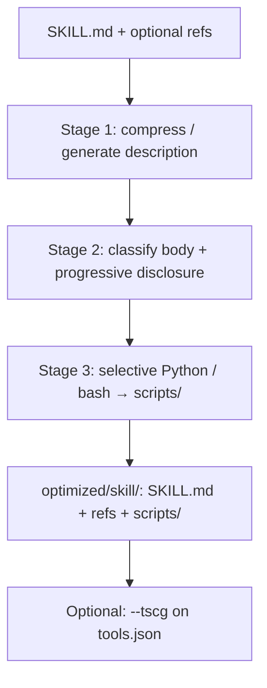

# skillreducer

> **New here?** Start with the [Beginner guide](BEGINNER.md) (install, first audit/reduce, optional TSCG).

Open-source toolkit for **token-efficient LLM agent skills**, grounded in three research papers:

| # | Paper | What it does | How you run it |
|---|--------|--------------|----------------|
| 1 | **SkillReducer** (Gao et al.) | Compress skill `description` + body (+ optional scripts) | `skillreducer reduce` / `agent` |
| 2 | **TSCG** (Sakizli) | Compress MCP / tool JSON schemas | `skillreducer reduce … --tscg` |
| 3 | **SkillRevise** (Liu et al.) | Revise skill quality from execution traces | `skillreducer revise` *(separate command)* |

| Resource | Link |
|----------|------|
| SkillReducer arXiv | [2603.29919](https://arxiv.org/abs/2603.29919) · [PDF](skill_reducer.pdf) · [Detail](PAPER_DETAIL.md) |
| TSCG arXiv | [2605.04107](https://arxiv.org/abs/2605.04107) · [Detail](docs/TSCG_PAPER_DETAIL.md) |
| SkillRevise arXiv | [2606.01139](https://arxiv.org/abs/2606.01139) · [Docs](src/skillrevise/README.md) |
| Paper index | [docs/PAPERS.md](docs/PAPERS.md) |
| Citations | [CITATION.md](CITATION.md) |

Works with **any agent platform** that uses the standard `SKILL.md` + YAML frontmatter convention (Claude Code, Windsurf, OpenCode, SkillHub, GitHub community skills, and similar).

```text
Optional quality pass     →  SkillRevise          →  skillreducer revise …
Skill text tokens         →  SkillReducer St.1–3  →  lean SKILL.md + refs + scripts/
Tool / MCP schemas        →  TSCG                 →  lean mcp_manifest.tscg.*
```

---

## The three papers (in detail)

### 1. SkillReducer — skill token debloating

> **SkillReducer: Optimizing LLM Agent Skills for Token Efficiency**  
> Yudong Gao, Zongjie Li, Yuanyuan Yuan, Zimo Ji, Pingchuan Ma, Shuai Wang  
> [arXiv:2603.29919](https://arxiv.org/abs/2603.29919)

**Problem.** Every token in a skill’s YAML `description` and body competes for context. The authors studied **55,315** public skills and found systemic waste: missing/short routing descriptions, monolithic bodies (only ~38.5% core rules), and heavy reference injection.

**Solution.** A **structure-aware** two-stage paper pipeline (this repo adds **Stage 3** for script extraction):

| Stage | Layer | Goal |
|-------|--------|------|
| **1** | Routing (`description`) | Minimal description that still routes correctly (DDMIN + simulated oracle) |
| **2** | Body | Keep core rules in `SKILL.md`; move examples / templates / background to on-demand refs |
| **3** *(this repo)* | Scripts | Selectively extract runnable Python / bash blocks into `scripts/` |

**Reported results (paper).** ~48% description compression, ~39% body compression, 86% functional retention; SkillsBench 87/87 with no regression.

Deep dive: [PAPER_DETAIL.md](PAPER_DETAIL.md) · Stage docs: [stage1](skillreducer/stage1/README.md) · [stage2](skillreducer/stage2/README.md) · [stage3](skillreducer/stage3/README.md)

### 2. TSCG — tool / MCP schema compression

> **TSCG: Token-efficient Schema Compression for Generative Agents** (and companion Agentic RAG paper)  
> Sakizli · [arXiv:2605.04107](https://arxiv.org/abs/2605.04107) · companion [2605.26165](https://arxiv.org/abs/2605.26165)

**Problem.** MCP / function-calling tool JSON schemas are often long; they burn context even when the skill body is already lean.

**Solution.** Compress tool schemas into a shorter representation (`mcp_manifest.tscg.*`) via `@tscg/core`, optionally after SkillReducer finishes the skill text.

**In this repo.** Optional flag on `reduce` / `agent` — does **not** replace Stages 1–3.

Deep dive: [docs/TSCG_PAPER_DETAIL.md](docs/TSCG_PAPER_DETAIL.md) · Setup: [skillreducer/tscg/README.md](skillreducer/tscg/README.md)

### 3. SkillRevise — execution-grounded skill quality

> **SkillRevise** · Liu et al. · [arXiv:2606.01139](https://arxiv.org/abs/2606.01139) · [upstream](https://github.com/xuansenpa1/skillrevise)

**Problem.** Compression alone does not fix incorrect or incomplete skills. Quality issues show up in **execution traces**.

**Solution.** Revise skills from task traces (separate research / CLI). Vendored under `src/skillrevise/`.

**In this repo.** Exposed as `skillreducer revise` — **not** wired into `reduce`. Use it when you care about behavior quality, not only token count.

Deep dive: [src/skillrevise/README.md](src/skillrevise/README.md)

---

## SkillReducer pipeline (Stages 1–3)



### Stage 1 — Routing layer

| | |
|--|--|
| **Input** | YAML `description` (missing, short, or verbose) |
| **Output** | Minimally sufficient third-person routing description |
| **Method** | Generate from body if empty/short → segment clauses → **DDMIN** with routing oracle (test queries, TF-IDF distractors, adversarial skill) → gated paraphrase → polish → selective restore on validation queries |
| **Docs** | [skillreducer/stage1/README.md](skillreducer/stage1/README.md) |

### Stage 2 — Body progressive disclosure

| | |
|--|--|
| **Input** | Monolithic `SKILL.md` body |
| **Output** | Slim core body + `examples.md` / `templates.md` / `background.md` with `when` / `topics` metadata |
| **Method** | Split paragraphs → classify (`core_rule`, `example`, `template`, `background`, `redundant`) → compress by type → token gate (keep original if not shorter) → dedup existing refs |
| **Docs** | [skillreducer/stage2/README.md](skillreducer/stage2/README.md) |

### Stage 3 — Script extraction *(repo extension)*

| | |
|--|--|
| **Input** | All `*.md` after Stage 2 (`SKILL.md`, refs, …) |
| **Output** | `scripts/*.py` and/or `scripts/*.sh` + short run references in markdown |
| **Method** | Scan fenced `python`/`py` and `bash`/`sh`/`shell`/`zsh` blocks → **LLM reviews each block** (`extract: true/false`; not bulk conversion) → write approved scripts → replace fences with `Run: \`python scripts/…\`` or `bash scripts/…` → revert if markdown tokens do not decrease |
| **Docs** | [skillreducer/stage3/README.md](skillreducer/stage3/README.md) |

Default `reduce` / `agent` runs **Stage 1 → 2 → 3**. Use `--stage N` for a single stage.

---

## Install

### Binary (recommended)

Download the latest `skillreducer` / `skillreducer.exe` from [GitHub Releases](https://github.com/zealgoswami-lab/skillreducer/releases), or build locally:

```bash
pip install -e ".[build]"
python build_binary.py
# Output: dist/skillreducer  (or dist/skillreducer.exe on Windows)
```

```bash
./dist/skillreducer audit path/to/my-skill
./dist/skillreducer agent path/to/my-skill
```

### From source

```bash
pip install -e .
# optional: pip install -e ".[dev]"
```

Copy `.env.example` to `.env` and set credentials:

```bash
cp .env.example .env
# api_key=sk-...
# api_base_url=https://api.openai.com/v1
```

```bash
python run.py audit data --recursive
python run.py reduce data/pdf-processing
python run.py agent data/marketing-strategy --stage 1

# or after pip install -e .
python -m skillreducer reduce data/pdf-processing
skillreducer reduce data/pdf-processing
```

---

## Usage

### Quick start (sample skills in [`data/`](data/))

```bash
python run.py audit data --recursive
python run.py reduce data/pdf-processing --no-llm
python run.py agent data/marketing-strategy --output optimized/
```

See [data/README.md](data/README.md) for what each sample skill demonstrates.

### Audit (token report + issue flags)

```bash
skillreducer audit path/to/my-skill
skillreducer audit ./skills --recursive
```

### Reduce — full SkillReducer pipeline (Stages 1–3)

Writes to `optimized/` by default (never in-place):

```bash
# All stages
skillreducer reduce path/to/my-skill
skillreducer reduce path/to/my-skill --output ./optimized --dry-run

# Single stage
skillreducer reduce path/to/my-skill --stage 1   # description only
skillreducer reduce path/to/my-skill --stage 2   # body disclosure only
skillreducer reduce path/to/my-skill --stage 3   # script extraction only

# Heuristic mode (no API calls)
skillreducer reduce path/to/my-skill --no-llm

# Batch
skillreducer reduce ~/.claude/skills --recursive
skillreducer reduce ./my-skill-library --recursive
```

### Agent — same pipeline via Agno

```bash
skillreducer agent path/to/my-skill
skillreducer agent path/to/my-skill --output ./optimized --stage 2
skillreducer agent ./skills --recursive
```

Python API:

```python
from pathlib import Path
from skillreducer.agent import SkillReducerAgent

agent = SkillReducerAgent()
result = agent.optimize(Path("path/to/my-skill"), output_dir=Path("optimized"))

print(result.skill_md)           # optimized SKILL.md path
print(result.reference_files)    # examples.md, templates.md, etc.
print(result.agent_summary)      # token savings summary
```

### Optional TSCG (paper 2) — compress tool schemas

Needs Node ≥ 18 and a one-time install:

```bash
cd skillreducer/tscg && npm install
skillreducer reduce path/to/my-skill --tscg --tools tools.json
```

Writes `mcp_manifest.json`, `mcp_manifest.tscg.txt`, and `mcp_manifest.tscg.json` into the optimized skill folder.

### Optional SkillRevise (paper 3) — quality from traces

**Separate command** — does not run inside `reduce`:

```bash
skillreducer revise --skillrevise-help
skillrevise path/to/tasks.json --limit 1 --output runs/out.json

# Benchmark / paper evals only (SkillsBench, etc.):
skillrevise-benchmark --help
skillrevise-benchmark path/to/tasks.json --manifest-kind skillsbench --limit 1
```

Docs: [src/skillrevise/README.md](src/skillrevise/README.md) · benchmarks: [src/skillrevise/benchmarks/README.md](src/skillrevise/benchmarks/README.md)
### CLI reference

| Command / flag | Description |
|----------------|-------------|
| `skillreducer audit <path>` | Token report + F1/F2/F3 issue flags |
| `skillreducer reduce <path>` | Stages 1–3 (OpenAI / configured LLM client) |
| `skillreducer agent <path>` | Same pipeline via Agno agent |
| `skillreducer revise …` | SkillRevise (Liu et al.) — quality, not compression |
| `--stage 1` / `2` / `3` | Run a single SkillReducer stage |
| `--tscg` / `--tools <json>` | Compress tool schemas with TSCG after reduce |
| `--recursive` | Process all skills under a directory |
| `--dry-run` | Report savings without writing files |
| `--no-llm` | Heuristic mode (no API calls) |
| `--output` / `-o` | Output directory (default: `optimized`) |

Simple flow + worked example: [docs/REDUCTION_FLOW.md](docs/REDUCTION_FLOW.md)

---

## Configuration

### API key, base URL, and models (from env)

Credentials and model ids are read from `.env` (auto-loaded on startup) or the environment. Env vars override `config.yaml`.

`.env` is discovered automatically: package root → parent directories of cwd → cwd (later paths win among `.env` files).

| Setting | Env name | YAML key |
|---------|----------|----------|
| **API key** | `api_key` | — |
| **API base URL** | `api_base_url` | `api_base_url` / `base_url` |
| **Compression model** (Stage 2 / general LLM) | `compression_model` | `models.compression` |
| **Routing model** (Stage 1 oracle) | `routing_model` | `models.routing_oracle` |
| **Evaluation model** (Gate 2, planned) | `evaluation_model` | `models.evaluation` |
| **TSCG enabled** | `tscg_enabled` | `tscg.enabled` |
| **TSCG model / profile** | `tscg_model` / `tscg_profile` | `tscg.model` / `tscg.profile` |

```bash
# .env (recommended)
api_key=sk-...
api_base_url=https://api.openai.com/v1
compression_model=gpt-4o-mini
routing_model=gpt-4o-mini
evaluation_model=gpt-4o-mini
```

Optional YAML (`config.example.yaml` → `config.yaml`):

```yaml
models:
  compression: gpt-4o-mini
  routing_oracle: gpt-4o-mini
  evaluation: gpt-4o-mini

thresholds:
  short_description_tokens: 40   # Stage 1: generate if description ≤ this
  min_reference_tokens: 30       # Stage 2: drop tiny reference files
  min_script_tokens: 20          # Stage 3: heuristic / LLM size hint
  max_restore_steps: 3           # Stage 1 Phase 2 restore
  max_feedback_iterations: 2     # Stage 2 Gate 2 (config only; not wired yet)

oracle:
  num_test_queries: 8
  num_distractors: 4
  include_adversarial: true

tscg:
  enabled: false
  model: claude-sonnet
  profile: balanced

use_llm: true
```

Without an API key, LLM features are disabled and heuristics are used. Use `--no-llm` to force heuristic-only mode.

---

## Standard skill layout

```
my-skill/
├── SKILL.md          # frontmatter + compressed core body (always loaded)
├── examples.md       # on-demand (Stage 2)
├── templates.md      # on-demand (Stage 2)
├── background.md     # on-demand (Stage 2)
└── scripts/          # executable tools (Stage 3; not context-injected)
    ├── extract.py
    └── batch.sh
```

After optimization, reference files include routing metadata (`when`, `topics`) so the agent can load them selectively.

---

## Issue codes (audit)

| Code | Meaning |
|------|---------|
| `F1_MISSING_DESCRIPTION` | No routing description in frontmatter |
| `F1_SHORT_DESCRIPTION` | Description too short for reliable routing |
| `F1_VERBOSE_DESCRIPTION` | Description likely contains non-routing filler |
| `F2_LARGE_BODY` / `F2_LONG_BODY` | Body too large; use progressive disclosure |
| `F2_MONOLITHIC` | Examples/templates embedded in SKILL.md |
| `F3_HEAVY_REFERENCES` | Reference files consume excessive tokens |

---

## Safety

- Never modifies skills in-place by default; output goes to `--output`.

## Development

```bash
pytest
ruff check skillreducer tests
```

## Research & citation

| Resource | Description |
|----------|-------------|
| [docs/PAPERS.md](docs/PAPERS.md) | **Paper index** — SkillReducer + TSCG + SkillRevise |
| [docs/REDUCTION_FLOW.md](docs/REDUCTION_FLOW.md) | Simple flow + one example |
| [PAPER_DETAIL.md](PAPER_DETAIL.md) | SkillReducer paper (Gao et al.) in depth |
| [docs/TSCG_PAPER_DETAIL.md](docs/TSCG_PAPER_DETAIL.md) | TSCG papers (Sakizli) in depth |
| [src/skillrevise/README.md](src/skillrevise/README.md) | Vendored SkillRevise (Liu et al.) |
| [CITATION.md](CITATION.md) | BibTeX / APA for all three papers |
| [skill_reducer.pdf](skill_reducer.pdf) | SkillReducer paper (local copy) |

If you use this tool in research, please cite the **SkillReducer paper** (Gao et al., 2026) for skill debloating, the **TSCG papers** (Sakizli, 2026) when discussing `--tscg`, and **SkillRevise** (Liu et al., 2026) for `revise` — not this repository alone.

## License

MIT — see [LICENSE](LICENSE). The research papers are © their authors; this repo is an independent implementation.
