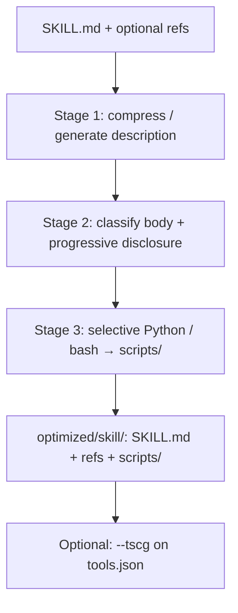

# skillreducer

> **Usage:** [USAGE.md](USAGE.md) — install, CLI, config, workflows.  
> **Beginner:** [BEGINNER.md](BEGINNER.md) · **All docs:** [docs/README.md](docs/README.md)

Open-source toolkit for **token-efficient LLM agent skills**, grounded in three research papers:

| # | Paper | What it does | How you run it |
|---|--------|--------------|----------------|
| 1 | **SkillReducer** (Gao et al.) | Compress skill `description` + body (+ optional scripts) | `skillreducer reduce` / `agent` |
| 2 | **TSCG** (Sakizli) | Compress MCP / tool JSON schemas | `skillreducer reduce … --tscg` |
| 3 | **SkillRevise** (Liu et al.) | Revise skill quality from execution traces | `skillreducer revise` *(separate command)* |

```text
Optional quality pass     →  SkillRevise          →  skillreducer revise …
Skill text tokens         →  SkillReducer St.1–3  →  lean SKILL.md + refs + scripts/
Tool / MCP schemas        →  TSCG                 →  lean mcp_manifest.tscg.*
```

Works with **any agent platform** that uses the standard `SKILL.md` + YAML frontmatter convention (Claude Code, Windsurf, OpenCode, SkillHub, GitHub community skills, and similar).

---

## Quick start

```bash
pip install -e .
skillreducer audit data/pdf-processing
skillreducer reduce data/pdf-processing --no-llm
```

Full install, flags, config, TSCG, and revise: **[USAGE.md](USAGE.md)**.

---

## Documentation layout

```text
USAGE.md                 ← top-level usage details (start here to run tools)
BEGINNER.md              ← beginner hub
docs/
  README.md              ← documentation index
  OVERVIEW.md            ← how the three papers fit
  PAPERS.md              ← paper index
  REDUCTION_FLOW.md      ← flow + worked example
  skillreducer/          ← PAPER · BEGINNER · USAGE
  tscg/                  ← PAPER · BEGINNER · USAGE
  skillrevise/           ← PAPER · BEGINNER · USAGE · DEVELOPER
CITATION.md
```

| Resource | Link |
|----------|------|
| **Usage (top-level)** | [USAGE.md](USAGE.md) |
| Docs index | [docs/README.md](docs/README.md) |
| SkillReducer | [docs/skillreducer/](docs/skillreducer/) |
| TSCG | [docs/tscg/](docs/tscg/) |
| SkillRevise | [docs/skillrevise/](docs/skillrevise/) |
| Papers overview | [docs/OVERVIEW.md](docs/OVERVIEW.md) · [docs/PAPERS.md](docs/PAPERS.md) |
| Citations | [CITATION.md](CITATION.md) |
| SkillReducer arXiv | [2603.29919](https://arxiv.org/abs/2603.29919) · [PDF](skill_reducer.pdf) |
| TSCG arXiv | [2605.04107](https://arxiv.org/abs/2605.04107) |
| SkillRevise arXiv | [2606.01139](https://arxiv.org/abs/2606.01139) |

---

## The three papers (short)

### 1. SkillReducer — skill token debloating

Compress routing `description`, restructure the body with progressive disclosure, optionally extract scripts.  
Docs: [PAPER](docs/skillreducer/PAPER.md) · [BEGINNER](docs/skillreducer/BEGINNER.md) · [USAGE](docs/skillreducer/USAGE.md) · [stage1](skillreducer/stage1/README.md) · [stage2](skillreducer/stage2/README.md) · [stage3](skillreducer/stage3/README.md)

### 2. TSCG — tool / MCP schema compression

Optional `--tscg` after skill reduction; you provide tools JSON.  
Docs: [PAPER](docs/tscg/PAPER.md) · [BEGINNER](docs/tscg/BEGINNER.md) · [USAGE](docs/tscg/USAGE.md)

### 3. SkillRevise — execution-grounded skill quality

Separate `revise` command; vendored under `src/skillrevise/`.  
Docs: [PAPER](docs/skillrevise/PAPER.md) · [BEGINNER](docs/skillrevise/BEGINNER.md) · [USAGE](docs/skillrevise/USAGE.md) · [DEVELOPER](docs/skillrevise/DEVELOPER.md)

---

## SkillReducer pipeline (Stages 1–3)



Default `reduce` / `agent` runs **Stage 1 → 2 → 3**. Use `--stage N` for a single stage.  
Commands and config: [USAGE.md](USAGE.md).

---

## Safety & development

- Never modifies skills in-place by default; output goes to `--output`.

```bash
pytest
ruff check skillreducer tests
```

## Research & citation

Cite the paper authors for methods and numbers — not this repository alone.  
[CITATION.md](CITATION.md) · [docs/PAPERS.md](docs/PAPERS.md)

## License

MIT — see [LICENSE](LICENSE). The research papers are © their authors; this repo is an independent implementation.
