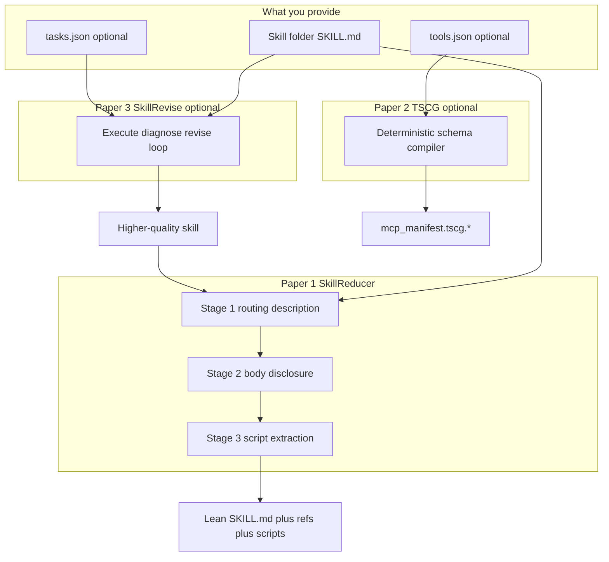

# Papers overview — full flow

This repository integrates **three research papers**. Each has its own explanation, beginner guide, and usage doc under `docs/`.

| # | Paper | What it optimizes | Docs |
|---|--------|-------------------|------|
| 1 | **SkillReducer** (Gao et al.) | Skill `description` + body tokens | [PAPER](skillreducer/PAPER.md) · [BEGINNER](skillreducer/BEGINNER.md) · [USAGE](skillreducer/USAGE.md) |
| 2 | **TSCG** (Sakizli) | MCP / tool JSON schema tokens | [PAPER](tscg/PAPER.md) · [BEGINNER](tscg/BEGINNER.md) · [USAGE](tscg/USAGE.md) |
| 3 | **SkillRevise** (Liu et al.) | Skill **quality** from traces | [PAPER](skillrevise/PAPER.md) · [BEGINNER](skillrevise/BEGINNER.md) · [USAGE](skillrevise/USAGE.md) · [DEVELOPER](skillrevise/DEVELOPER.md) |

**Papers:** [PAPERS.md](PAPERS.md) · **Citations:** [CITATION.md](../CITATION.md)

> **Attribution.** Algorithm design and empirical results belong to each paper’s authors. This repo is an independent implementation / integration.

---

## How the three papers fit together

Skills, tools, and quality are **different problems**. Compressing markdown does not shrink MCP schemas; compressing schemas does not fix wrong instructions; revising from traces does not by itself minimize tokens.



```text
Optional quality   →  SkillRevise (Liu et al.)     →  skillreducer revise …
Skill text tokens  →  SkillReducer (Gao et al.)    →  lean SKILL.md + refs + scripts/
Tool schemas       →  TSCG (Sakizli)               →  lean mcp_manifest.tscg.*
```

| Concern | Paper | Does | Does not |
|---------|--------|------|----------|
| Token cost of `SKILL.md` | SkillReducer | Compress routing + body; extract scripts | Fix incorrect behavior |
| Token cost of tool JSON | TSCG | Compile verbose schemas to compact text | Edit skill markdown |
| Skill behavior quality | SkillRevise | Diagnose failures from execution traces and revise | Replace `reduce` / Stages 1–3 |

---

## Full end-to-end flow (recommended)

Use only the steps you need. Nothing requires all three papers.

### Path A — tokens only (most users)

```text
skill folder
    │
    ▼
skillreducer audit          ← see bloat / issue flags
    │
    ▼
skillreducer reduce         ← Stages 1 → 2 → 3
    │
    ├─ optional: --tscg --tools tools.json
    │
    ▼
optimized/<skill>/
  SKILL.md + refs + scripts/  (+ mcp_manifest.tscg.* if --tscg)
```

```bash
skillreducer audit ./my-skill
skillreducer reduce ./my-skill --output optimized/
# with tools:
cd skillreducer/tscg && npm install && cd ../..
skillreducer reduce ./my-skill --tscg --tools tools.json
```

### Path B — quality first, then tokens

```text
tasks.json + SKILL.md
    │
    ▼
skillrevise / skillreducer revise     ← improve behavior from traces
    │
    ▼
revised SKILL.md
    │
    ▼
skillreducer reduce [--tscg]          ← then shrink context cost
```

```bash
skillrevise tasks.json --initial-skill ./my-skill/SKILL.md --max-revisions 3 --output runs/out.json
skillreducer reduce ./my-skill --output optimized/ --tscg --tools tools.json
```

### Path C — schemas only (skill already lean)

```bash
skillreducer reduce ./my-skill --stage 1 --dry-run   # optional check
skillreducer reduce ./my-skill --tscg --tools tools.json
```

TSCG still runs through the `reduce` / `agent` entrypoints; without tools JSON it is skipped.

---

## Per-paper stage detail (quick map)

### SkillReducer (Stages 1–3)

| Stage | Layer | Output idea |
|-------|--------|-------------|
| 1 | Routing `description` | Short description that still routes |
| 2 | Body | Core rules in `SKILL.md`; examples/templates/background → refs |
| 3 | Scripts | Runnable blocks → `scripts/` (this repo) |

Deep dive: [skillreducer/PAPER.md](skillreducer/PAPER.md) · [USAGE](skillreducer/USAGE.md)

### TSCG

| Step | What happens |
|------|----------------|
| Normalize | OpenAI / Anthropic / `{tools:[…]}` → common shape |
| Compile | `@tscg/core` via Node bridge (local, no LLM) |
| Write | `mcp_manifest.tscg.txt` + metrics JSON |

Deep dive: [tscg/PAPER.md](tscg/PAPER.md) · [USAGE](tscg/USAGE.md)

### SkillRevise

| Step | What happens |
|------|----------------|
| Execute | Run skill on task under verifier/harness |
| Diagnose | Attribution + preservation from trace |
| Revise | Principle-bound, execution-anchored edits |
| Select | First verifier pass, else utility fallback |

Deep dive: [skillrevise/PAPER.md](skillrevise/PAPER.md) · [USAGE](skillrevise/USAGE.md) · [DEVELOPER](skillrevise/DEVELOPER.md)

---

## Worked reduce example

Simple diagrams + one before/after: [REDUCTION_FLOW.md](REDUCTION_FLOW.md)

---

## Doc map

| Doc | Use when |
|-----|----------|
| [PAPERS.md](PAPERS.md) | Paper index + links |
| [skillreducer/](skillreducer/) | Skill token debloating |
| [tscg/](tscg/) | Tool schema compression |
| [skillrevise/](skillrevise/) | Trace-conditioned revision |
