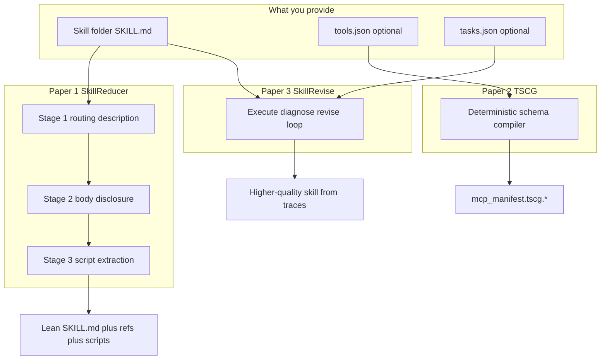

# Papers overview

This repository integrates **three research papers**. Each has its own explanation, beginner guide, and usage doc under `docs/`.

| # | Paper | What it optimizes | Docs |
|---|--------|-------------------|------|
| 1 | **SkillReducer** (Gao et al.) | Skill `description` + body tokens | [PAPER](skillreducer/PAPER.md) · [BEGINNER](skillreducer/BEGINNER.md) · [USAGE](skillreducer/USAGE.md) |
| 2 | **TSCG** (Sakizli) | MCP / tool JSON schema tokens | [PAPER](tscg/PAPER.md) · [BEGINNER](tscg/BEGINNER.md) · [USAGE](tscg/USAGE.md) |
| 3 | **SkillRevise** (Liu et al.) | Skill **quality** from traces | [PAPER](skillrevise/PAPER.md) · [BEGINNER](skillrevise/BEGINNER.md) · [USAGE](skillrevise/USAGE.md) |

**Citations:** [CITATION.md](../CITATION.md) · **Index:** [PAPERS.md](PAPERS.md)

> **Attribution.** Algorithm design and empirical results belong to each paper’s authors. This repo is an independent implementation / integration.

---

## How the three papers fit together

Skills, tools, and quality are **different problems**. Compressing markdown does not shrink MCP schemas; compressing schemas does not fix wrong instructions; revising from traces does not by itself minimize tokens.



```text
Optional quality   →  SkillRevise (Liu et al.)     →  skillreducer revise …
Skill text tokens  →  SkillReducer (Gao et al.)    →  lean SKILL.md + refs + scripts/
Tool schemas       →  TSCG (Sakizli)               →  lean mcp_manifest.tscg.*
```

| Concern | Paper | Does | Does not |
|---------|--------|------|----------|
| Token cost of `SKILL.md` | SkillReducer | Compress routing + body; extract scripts | Fix incorrect behavior |
| Token cost of tool JSON | TSCG | Compile verbose schemas to compact text | Edit skill markdown |
| Skill behavior quality | SkillRevise | Diagnose failures from execution traces and revise | Replace `reduce` / Stages 1–3 |

Flow diagrams (simple + one example): [REDUCTION_FLOW.md](REDUCTION_FLOW.md)
