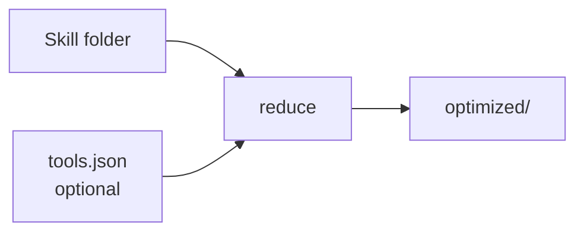

# How reduction works (simple) + one example

## The idea in one sentence

You give a **skill folder**. SkillReducer makes `SKILL.md` shorter.  
If you also give an **MCP tools JSON**, TSCG makes those tool schemas shorter too.

---

## Simple flow

```text
YOU
  ├── my-skill/SKILL.md          ← required
  └── tools.json                 ← only if you want --tscg
         │
         ▼
  skillreducer reduce ...
         │
    ┌────┴────┐
    ▼         ▼
 Skill text   Tool schemas
 get smaller  get smaller (--tscg)
    │         │
    └────┬────┘
         ▼
  optimized/my-skill/
```



---

## One example

### What you start with

**Folder `demo-skill/SKILL.md`:**

```markdown
---
name: demo-skill
description: This skill helps you extract text from PDF files using various methods and libraries and also documents many edge cases in a long way.
---

# PDF helper

Always validate the file path first.
Never invent page content.

## Example
Run extract on report.pdf and print the first page.

## Background
PDFs can be scanned or digital; OCR is sometimes needed...
```

**File `tools.json` (you provide this for tools):**

```json
{
  "tools": [
    {
      "type": "function",
      "function": {
        "name": "extract_pdf",
        "description": "Extract text from a PDF file at the given path",
        "parameters": {
          "type": "object",
          "properties": {
            "path": {
              "type": "string",
              "description": "Path to the PDF file on disk"
            },
            "pages": {
              "type": "string",
              "description": "Optional page range, e.g. 1-3"
            }
          },
          "required": ["path"]
        }
      }
    }
  ]
}
```

### Commands

```bash
# 1) See tokens (optional)
skillreducer audit demo-skill

# 2) Reduce skill + compress your MCP JSON (offline skill mode)
skillreducer reduce demo-skill --no-llm --tscg --tools tools.json
```

First time only for TSCG:

```bash
cd skillreducer/tscg && npm install && cd ../..
```

### What you get

```text
optimized/demo-skill/
├── SKILL.md                  ← shorter description + core rules
├── examples.md / background  ← moved out (when Stage 2 applies)
├── mcp_manifest.json         ← your tools (full)
├── mcp_manifest.tscg.txt     ← compressed tools (fewer tokens)
└── mcp_manifest.tscg.json    ← before/after numbers
```

**Skill side (idea):** long description → short routing line; examples/background leave the main body.

**Tool side — JSON before → after:**

```text
BEFORE (tools.json — verbose JSON Schema)
{
  "name": "extract_pdf",
  "description": "Extract text from a PDF file at the given path",
  "parameters": {
    "type": "object",
    "properties": {
      "path":  { "type": "string", "description": "Path to the PDF file on disk" },
      "pages": { "type": "string", "description": "Optional page range, e.g. 1-3" }
    },
    "required": ["path"]
  }
}

AFTER (mcp_manifest.tscg.txt — compact)
extract_pdf(path:str!, pages?:str) -> text
```

| Symbol | Meaning |
|--------|---------|
| `str!` | required string |
| `pages?:str` | optional string |
| `-> text` | short return hint |

That one line replaces the whole nested JSON for the model’s tool list (often ~50–70% fewer schema tokens).

### Report (what to look for)

```text
Description / Body / Total   … savings %
TSCG (tool schemas)          … before -> after tokens
```

---

## Two commands only (cheat sheet)

| Want | Command |
|------|---------|
| Skill only | `skillreducer reduce demo-skill --no-llm` |
| Skill + tools | `skillreducer reduce demo-skill --no-llm --tscg --tools tools.json` |

**Remember:** for `--tscg` you **must** provide the MCP JSON. The tool does not invent it from `server.py`.

---

## More detail (optional)

| Doc | When |
|-----|------|
| [BEGINNER.md](../BEGINNER.md) | Install and first steps |
| [TSCG README](../skillreducer/tscg/README.md) | MCP JSON formats / errors |
| [PAPERS.md](PAPERS.md) | Research papers behind each step |
