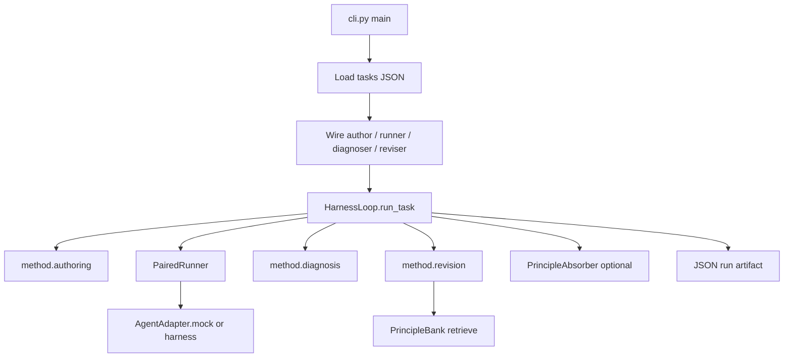
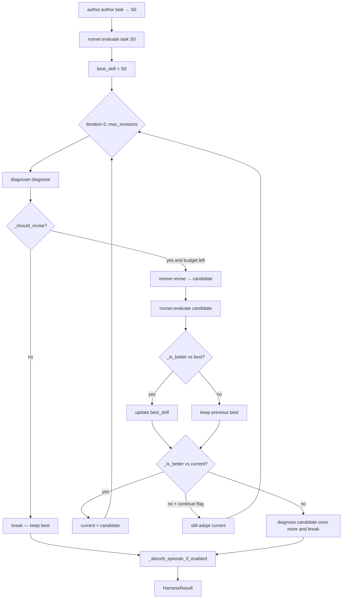
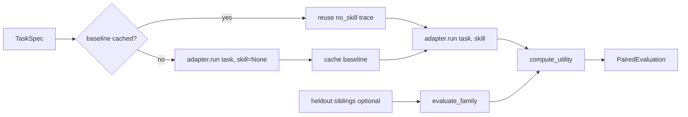
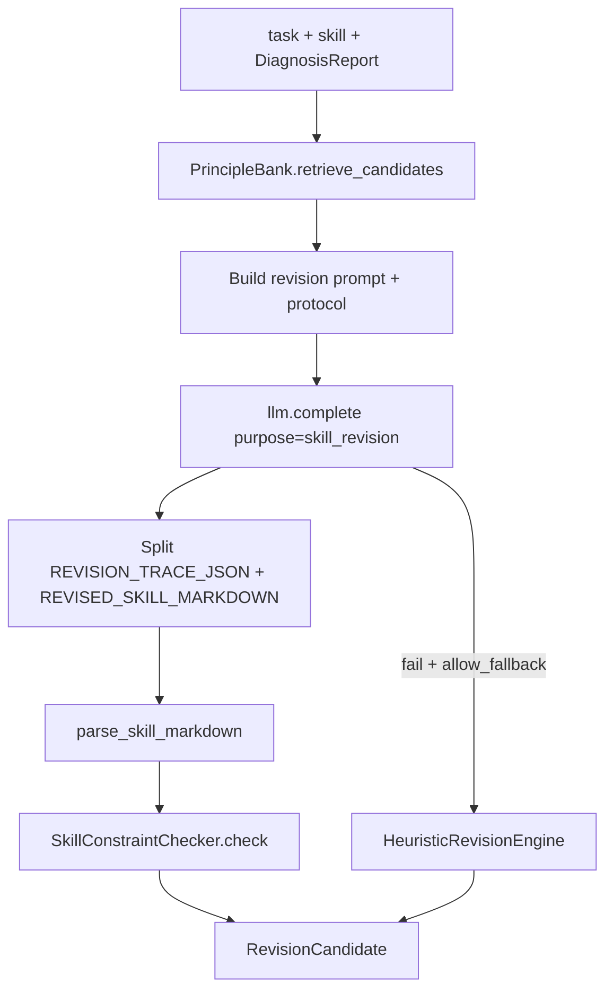

# SkillRevise — Developer guide

Deep dive for contributors: how the vendored package works, which files own each stage, and how the algorithms are implemented in code.

| Related docs | |
|--------------|--|
| Top-level usage | [../../USAGE.md](../../USAGE.md) |
| Docs index | [../README.md](../README.md) |
| Paper concepts | [PAPER.md](PAPER.md) |
| First run | [BEGINNER.md](BEGINNER.md) |
| CLI flags | [USAGE.md](USAGE.md) |
| Package README | [`src/skillrevise/README.md`](../../src/skillrevise/README.md) |
| Upstream | [xuansenpa1/skillrevise](https://github.com/xuansenpa1/skillrevise) · arXiv [2606.01139](https://arxiv.org/abs/2606.01139) |

**Location in this repo:** `src/skillrevise/` (import name `skillrevise`).  
**Not** SkillReducer Stages 1–3 and **not** TSCG — quality from traces, not token compression.

---

## Table of contents

1. [Big picture](#1-big-picture)
2. [Package layout (primary files)](#2-package-layout-primary-files)
3. [End-to-end flow diagrams](#3-end-to-end-flow-diagrams)
4. [Data model](#4-data-model)
5. [CLI wiring](#5-cli-wiring)
6. [Algorithm: HarnessLoop](#6-algorithm-harnessloop)
7. [Algorithm: Paired evaluation & utility](#7-algorithm-paired-evaluation--utility)
8. [Algorithm: Authoring](#8-algorithm-authoring)
9. [Algorithm: Diagnosis](#9-algorithm-diagnosis)
10. [Algorithm: Principle Memory](#10-algorithm-principle-memory)
11. [Algorithm: Revision](#11-algorithm-revision)
12. [Principle absorption](#12-principle-absorption)
13. [Agent adapters & benchmarks](#13-agent-adapters--benchmarks)
14. [Where to change what](#14-where-to-change-what)
15. [Mental map: paper ↔ code](#15-mental-map-paper--code)

---

## 1. Big picture

SkillRevise improves an imperfect skill \(S_0\) with a **bounded** loop:

```text
author/load S0
    → paired execute (no-skill vs with-skill)
    → diagnose failure labels + rewrite targets
    → retrieve repair principles (optional)
    → revise skill → candidate Ŝ
    → re-evaluate candidate
    → keep best by utility (or continue exploring)
    → optional: absorb a new principle into the bank
```

Three pluggable **modes** exist for most stages so you can run without an LLM, with heuristics, or with structured LLM prompts:

| Stage | Modes (CLI) | Default |
|-------|-------------|---------|
| Author | `template`, `prior`, `llm`, `llm-principle`, … | `template` |
| Diagnosis | `heuristic`, `llm`, `none` | `heuristic` |
| Revision | `heuristic`, `llm`, `llm-structured`, `llm-principle-bank`, `llm-freeform` | `heuristic` |
| Execution | `MockAgentAdapter` or `--harness-command` | mock |

Orchestrator: **`HarnessLoop`** in `core/loop.py`. Everything else is injected (author, runner, diagnoser, reviser, optional absorber).

---

## 2. Package layout (primary files)

```text
src/skillrevise/
├── cli.py                 ★ Entry: argparse → wire components → HarnessLoop
├── __init__.py
├── core/                  ★ Runtime harness
│   ├── loop.py            ★★ HarnessLoop (main algorithm)
│   ├── runner.py          ★★ PairedRunner (no-skill + with-skill + utility)
│   ├── models.py          ★★ Dataclasses (TaskSpec, Skill, traces, diagnosis…)
│   ├── metrics.py         ★ UtilityWeights + compute_utility
│   ├── agents.py          ★ AgentAdapter protocol + MockAgentAdapter
│   ├── artifacts.py       ArtifactStore for real harness runs
│   ├── env.py             Env helpers (SKILL_REVISE_*)
│   ├── io.py              load_tasks / write_json / to_jsonable
│   └── reporting.py       summarize_results / summarize_baseline_runs
├── method/                ★ Paper algorithms
│   ├── authoring.py       ★ SkillAuthor + SkillConstraintChecker + priors
│   ├── diagnosis.py       ★ HeuristicDiagnoser / LLMDiagnoser / NoOpDiagnoser
│   ├── revision.py        ★ Heuristic / LLM / FreeForm revision engines
│   ├── principles.py      ★★ PrincipleBank retrieval + PrincipleAbsorber
│   └── skill_parser.py    Markdown ↔ Skill
├── llm/
│   ├── client.py          LLMClient protocol
│   └── command.py         CommandLLMClient + skillrevise-llm CLI
└── benchmarks/            Eval-only (SkillsBench, ALFWorld, …)
    ├── run_benchmark.py
    ├── skillsbench*.py
    ├── verifier.py
    └── …
```

### Responsibility cheat sheet

| Concern | Primary file | Key type |
|---------|--------------|----------|
| Orchestration | `core/loop.py` | `HarnessLoop` |
| Paired runs | `core/runner.py` | `PairedRunner` |
| Utility score | `core/metrics.py` | `compute_utility` |
| Domain types | `core/models.py` | `TaskSpec`, `Skill`, `DiagnosisReport`, … |
| Execute task | `core/agents.py` | `AgentAdapter` |
| Initial skill | `method/authoring.py` | `SkillAuthor` |
| Failure labels | `method/diagnosis.py` | `Diagnoser` |
| Edit skill | `method/revision.py` | `RevisionEngine` |
| Principle bank | `method/principles.py` | `PrincipleBank`, `PrincipleAbsorber` |
| Wire it all | `cli.py` | `main()` |

---

## 3. End-to-end flow diagrams

### 3.1 System architecture



### 3.2 One task episode (`HarnessLoop.run_task`)



### 3.3 Paired evaluation



### 3.4 LLM revision with principle bank



---

## 4. Data model

Defined in `core/models.py`.

| Type | Role |
|------|------|
| `TaskSpec` | `task_id`, `family`, `instruction`, `acceptance_criteria`, `context`, `metadata` |
| `Skill` | Structured skill: `name`, `purpose`, `when_to_use`, `procedure[]`, `constraints[]`, `version`, `metadata` → `as_markdown()` |
| `ExecutionTrace` | One run: success/status, tokens/tools/steps/latency, `events[]`, `metadata` (e.g. `reward`, `timed_out`) |
| `TrajectoryEvent` | Step in a trace (`kind`, `summary`, `evidence`) |
| `PairedEvaluation` | `no_skill` + `with_skill` traces + `UtilityBreakdown` + optional transfer summary |
| `DiagnosisReport` | `labels: FailureType[]`, `evidence[]`, `causal_judgment`, `rewrite_targets[]`, `summary` |
| `FailureType` | Enum: over_specificity, over_generality, wrong_abstraction_level, context_pollution, environment_mismatch, false_certainty |
| `RepairPrinciple` | Bank entry: triggers, repair_rule, templates, failure_types, provenance, … |
| `RevisionCandidate` | `revised_skill`, `rationale`, selected `principles`, `metadata` (revision_trace, …) |
| `HarnessIteration` | One loop step: skill, evaluation, diagnosis, optional revision |
| `HarnessResult` | Full episode: initial, iterations, `selected_skill`, `selected_evaluation` |

Skill markdown shape expected by parser / authors:

```markdown
# Name
## Purpose
## When to Use
## Procedure
- step
## Constraints / Pitfalls
- constraint
```

---

## 5. CLI wiring

`cli.py` is the composition root:

1. Parse args (author/diagnosis/revision modes, utility, principles, harness, …).
2. Load tasks (`generic` JSON or SkillsBench / SkillLearnBench / ALFWorld loaders).
3. Choose adapter: `MockAgentAdapter` unless `--harness-command` → `SkillsBenchAgentAdapter`.
4. Optionally `--baseline-only` (no revision) or reuse `--baseline-run` no-skill traces.
5. Build `PairedRunner`, diagnoser, reviser, author, optional `PrincipleAbsorber`.
6. For each task (× `--repeat`): `HarnessLoop.run_task(...)`, write progressive JSON.

SkillReducer integration: `skillreducer revise …` only forwards argv into `skillrevise.cli` — it does not call Stages 1–3.

---

## 6. Algorithm: HarnessLoop

**File:** `core/loop.py`

### Pseudocode

```text
function run_task(task, heldout_tasks=None):
    S ← author.author(task)
    E ← runner.evaluate(task, S, transfer_tasks=heldout)
    best_S, best_E ← S, E
    current_S, current_E ← S, E

    for i in 0 .. max_revisions:
        D ← diagnoser.diagnose(task, current_S, current_E)
        revision ← None
        if i < max_revisions and should_revise(current_E, D):
            revision ← reviser.revise(task, current_S, D)
        record iteration(i, current_S, current_E, D, revision)
        if revision is None: break

        E' ← runner.evaluate(task, revision.revised_skill, …)
        if is_better(E', best_E): best ← revision
        if is_better(E', current_E):
            current ← revision
        else if continue_after_non_improving_revision and budget left:
            current ← revision   # explore
        else:
            record final diagnosed candidate; break

    result ← HarnessResult(selected=best)
    absorb_episode_if_enabled(result)
    return result
```

### Revision gate (`_should_revise`)

Skip revision when:

- `require_diagnosis_for_revision` and diagnosis has **no labels**, or
- evaluation is invalid for revision (timeout / empty / “no valid benchmark reward” without usable events), or
- with-skill already **succeeded** with `reward >= 1.0`.

Otherwise revise if labels exist (or diagnosis is not required).

### Selection (`_is_better`)

Lexicographic preference:

1. Higher `utility.overall_score`
2. Else prefer with-skill **success**
3. Else prefer a “selectable” with-skill trace (not timed out, has outcome score, has events/tool_calls)
4. Else lower efficiency key (tokens → tool_calls → steps)

**Important:** `selected_skill` is the **best-so-far by utility**, which may differ from the last `current_skill` used as the search base when exploration is on.

---

## 7. Algorithm: Paired evaluation & utility

**Files:** `core/runner.py`, `core/metrics.py`

### PairedRunner

1. Cache **no-skill** baseline per `task_id` (expensive runs reused across revisions).
2. Run **with-skill** for the candidate skill.
3. Optionally evaluate **held-out sibling** tasks → `transfer_gain` and interference.
4. Retry a run up to `max_evaluation_attempts` (env `SKILL_REVISE_EVALUATION_RETRY_ATTEMPTS`, default 3) if timed out, missing reward, or empty trace.

### Utility formula

\[
U = \alpha \cdot \Delta_{\text{success}}
  + \beta \cdot \text{efficiency\_gain}
  + \gamma \cdot \text{transfer\_gain}
  - \lambda \cdot \text{interference}
\]

Where:

- \(\Delta_{\text{success}}\) = `trace_outcome_score(with)` − `trace_outcome_score(no)`  
  (`reward` metadata if present, else binary success)
- `efficiency_gain` = mean relative reduction of tokens, tool_calls, steps, latency
- `interference` = 1 if no-skill succeeded but with-skill failed (also considered on transfer set)
- Defaults (`UtilityWeights`): \(\alpha=1\), \(\beta=0.35\), \(\gamma=0.35\), \(\lambda=0.75\)

Presets: `full`, `success-only`, `efficiency-only`, `transfer-only`, `no-interference` (`UTILITY_PRESETS`).

If either side lacks a valid reward, utility is zeroed with a note — loop treats that carefully for revision validity.

---

## 8. Algorithm: Authoring

**File:** `method/authoring.py`

Produces initial `Skill` \(S_0\).

| Mode | Class / behavior |
|------|------------------|
| `template` | `TemplateSkillAuthor` — deterministic scaffold from task family |
| `prior` | `PriorGuidedSkillAuthor` — stronger constraint-aware template |
| `llm` / variants | `LLMSkillAuthor` (+ principle-aware builders) |
| `--initial-skill` | `FileSkillAuthor` — load Markdown as \(S_0\) |

**`SkillConstraintChecker`** encodes platform-agnostic authoring priors (used by diagnosis + revision prompts too):

- Clear trigger (`when_to_use`)
- Explicit workflow (≥4 steps, workflow markers)
- Input validation, environment grounding, fallbacks
- Strict constraints, avoid over-specific literals, word budget (~220), avoid empty generic advice / false certainty

Violations map into diagnosis labels via `VIOLATION_TO_FAILURE` in `diagnosis.py`.

---

## 9. Algorithm: Diagnosis

**File:** `method/diagnosis.py`

### Failure taxonomy (`FailureType`)

| Label | Intuition |
|-------|-----------|
| `over_specificity` | Hard-coded paths/commands that won’t transfer |
| `over_generality` | Vague advice, few executable steps |
| `wrong_abstraction_level` | Not a mid-level reusable workflow |
| `context_pollution` | Too long / inflates tokens without gain |
| `environment_mismatch` | Env errors in trajectory |
| `false_certainty` | Unconditional “always/must” without validation |

### HeuristicDiagnoser (default)

1. Run `SkillConstraintChecker` → map violations to labels + evidence (`authoring_prior`).
2. Add **execution** evidence: verifier events, outcome summary when with-skill failed.
3. Pattern checks on skill text + paired eval (literals, generic markers, token inflation, env_error events, absolute markers).
4. If still unlabeled but utility ≤ 0 → `wrong_abstraction_level`.
5. Build `causal_judgment`, `rewrite_targets` (including **verifier-specific** targets parsed from evidence text, e.g. graph reachability / missing files).

### LLMDiagnoser

Prompt with task, skill, traces, utility, prior violations → JSON report; on failure falls back to heuristic.

### NoOpDiagnoser

Empty labels (ablation: `--diagnosis-mode none` / `--ablation-condition no-diagnosis`). With `require_diagnosis_for_revision=True` (default), empty labels **block** revision unless that requirement is relaxed.

---

## 10. Algorithm: Principle Memory

**File:** `method/principles.py`

### PrincipleBank

- Seeded by `DEFAULT_SEED_PRINCIPLES` (workflow checkpoints, schema validation, environment discovery, anti-overfit, …).
- Load/save JSON via `from_json` / `write_json`.
- **Retrieve** top-\(k\) principles for `(task, diagnosis)`.

### Retrieval methods (`PrincipleRetrievalConfig.method`)

| Method | Behavior |
|--------|----------|
| `legacy` | Keyword / failure-type heuristic scoring |
| `bm25` | Sparse BM25 over principle text |
| `dense` | Embedding similarity (OpenAI-compatible URL) |
| `hybrid-rrf` **(default)** | BM25 + dense → **reciprocal rank fusion** |

RRF fusion uses `keyword_weight`, `semantic_weight`, `rrf_k` (default 60). Dense failure raises unless scores available; hybrid can fall back to legacy if fusion empty.

Retrieved candidates are rendered into the LLM revision prompt (`render_candidates_for_prompt`) with intent, trigger, repair rule, action/verification templates, transfer constraints.

---

## 11. Algorithm: Revision

**File:** `method/revision.py`

### Engines

| Mode | Engine | Behavior |
|------|--------|----------|
| `heuristic` | `HeuristicRevisionEngine` | Rebuild procedure/constraints from diagnosis labels (no LLM) |
| `llm` / `llm-structured` / `llm-principle-bank` | `LLMRevisionEngine` | Structured protocol + optional principle bank |
| `llm-freeform` | `FreeFormLLMRevisionEngine` | No taxonomy / principle checklist; feedback only |

### LLMRevisionEngine (paper-aligned path)

1. Optionally `principle_bank.retrieve_candidates(task, diagnosis, limit)`.
2. Build prompt with:
   - Authoring prior text
   - Retrieved principles (or ablation: diagnosis-only)
   - **Principle-bank** or **diagnosis-guided** numbered protocol
   - Task-local **revision memory** from previous `skill.metadata["revision_trace"]`
   - Diagnosis labels, evidence, rewrite targets
3. LLM returns two blocks:
   - `REVISION_TRACE_JSON` — verifier contract, failure ledger, preserve ledger, selected principles, execution anchors, acceptance signals
   - `REVISED_SKILL_MARKDOWN` — new skill
4. Parse markdown → bump version (`v0` → `v1` …).
5. Attach metadata: retrieved/selected principle ids, revision_trace, execution_anchors, framework version.
6. On LLM failure → heuristic fallback (unless `allow_fallback=False` / `--strict-llm` paths).

### Structured revision protocol (what the LLM is asked to do)

1. **Verifier Contract** — observable paths/schemas/assertions only  
2. **Failure Ledger** — failed checks, actual behavior, likely cause, primary failure type  
3. **Preserve Ledger** — what already passed (ablation: `no-preserve-ledger`)  
4. **Select ≤3 principles** with why / induced skill operation  
5. **Repeated-failure escalation** — same primary failure twice → method-level repair  
6. **Execution anchors** — action + expected evidence + placement (ablation: `no-execution-anchors`)  
7. Minimal scope, anti-overfitting, verifier alignment, acceptance signals  

Ablations (`REVISION_ABLATIONS`): `none` | `no-execution-anchors` | `no-preserve-ledger`.

### HeuristicRevisionEngine

Deterministic rewrite: validated mid-level workflow steps + constraints tuned by diagnosis labels (e.g. trim length on context pollution, insert checkpoint on over-generality).

---

## 12. Principle absorption

**Class:** `PrincipleAbsorber` in `method/principles.py`  
**Enable:** `--enable-principle-absorption` (+ optional `--principle-bank-output`)

Runs **once per finished episode** (`absorb_episode`), not after every intermediate revision.

Gates (all must pass):

1. Selected skill version ≠ initial version (something improved and was selected).
2. Find the iteration whose revision produced the selected skill.
3. `utility_gain = after.U − before.U` > threshold (default 0).
4. Absolute after utility > threshold.
5. Diagnosis has evidence.
6. Outcome scores exist; `after − before` outcome gain > threshold; after ≥ no-skill score.

Then builds a new `RepairPrinciple` from diagnosis + revision metadata and `principle_bank.add(...)` if id is new.

---

## 13. Agent adapters & benchmarks

### AgentAdapter

Protocol: `run(task, skill | None) -> ExecutionTrace`.

| Adapter | When |
|---------|------|
| `MockAgentAdapter` | Default local/dev — scores skill text against task metadata keywords / anti-patterns |
| `SkillsBenchAgentAdapter` + `CommandAgentHarness` | `--harness-command` (+ optional `--verifier-command`, artifacts) |

### Benchmarks package

Eval-only loaders and runners under `benchmarks/`. Everyday skill revision uses generic `tasks.json` + `skillrevise`. Full paper datasets are **not** vendored — clone upstream for large `data/` trees. See `benchmarks/README.md`.

---

## 14. Where to change what

| Goal | Touch |
|------|--------|
| Change loop stop / selection policy | `core/loop.py` |
| Change utility math or presets | `core/metrics.py` |
| Add failure labels | `FailureType` + `HeuristicDiagnoser` + seed principles |
| Add seed repair principles | `DEFAULT_SEED_PRINCIPLES` in `principles.py` |
| Change revision JSON schema / protocol text | helpers in `revision.py` (`_principle_bank_revision_protocol`, templates) |
| New authoring strategy | implement `SkillAuthor` in `authoring.py`, wire in `cli.py` |
| Real agent backend | implement `AgentAdapter`, pass via CLI harness flags |
| Persist more run fields | `reporting.py` / `to_jsonable` usage in `cli.py` |

### Suggested local debug path

```bash
# No LLM, mock agent — exercises loop + heuristic diagnose/revise
skillrevise path/to/tasks.json --limit 1 --max-revisions 2 \
  --author-mode template --diagnosis-mode heuristic --revision-mode heuristic \
  --output runs/debug.json
```

Inspect `runs/debug.json`: `iterations[].diagnosis`, `iterations[].revision`, `selected_evaluation.utility`.

---

## 15. Mental map: paper ↔ code

| Paper idea | Code |
|------------|------|
| Cold-start \(S_0\) | `SkillAuthor` / `--initial-skill` |
| Execute under verifier | `AgentAdapter` + optional `CommandVerifier` |
| Diagnosis \(V, A, K\) | `DiagnosisReport` (labels ≈ defects; rewrite_targets ≈ repair constraints; evidence ≈ attribution). Preserve ledger lives mainly in **revision trace**, not a separate diagnosis field. |
| Principle Memory \(\mathcal{M}\) | `PrincipleBank` + seed principles + absorption |
| Retrieve + bind | `retrieve_candidates` + LLM “selected_principles” in revision trace |
| Revision operator \(\mathcal{R}\) | `RevisionEngine.revise` |
| Budget \(B\) | `--max-revisions` |
| Verifier-first / utility fallback | Loop prefers success via utility; overall selection is **utility-first with success tie-breaks** (`_is_better`) rather than a hard “first pass returns immediately” short-circuit — passing high-reward skills also **skip further revision** via `_should_revise` |
| Principle absorption | `PrincipleAbsorber.absorb_episode` |

---

## Quick reference: call stack

```text
cli.main
  └─ HarnessLoop.run_task
       ├─ SkillAuthor.author
       ├─ PairedRunner.evaluate
       │    ├─ AgentAdapter.run (None)
       │    ├─ AgentAdapter.run (skill)
       │    └─ compute_utility
       ├─ Diagnoser.diagnose
       ├─ RevisionEngine.revise
       │    ├─ PrincipleBank.retrieve_candidates   (LLM path)
       │    ├─ LLMClient.complete
       │    └─ parse_skill_markdown
       └─ PrincipleAbsorber.absorb_episode         (optional)
```

---

*This document describes the vendored implementation in this repository. Algorithm design and empirical results belong to Liu et al. (2026) — see [PAPER.md](PAPER.md) and [CITATION.md](../../CITATION.md).*
