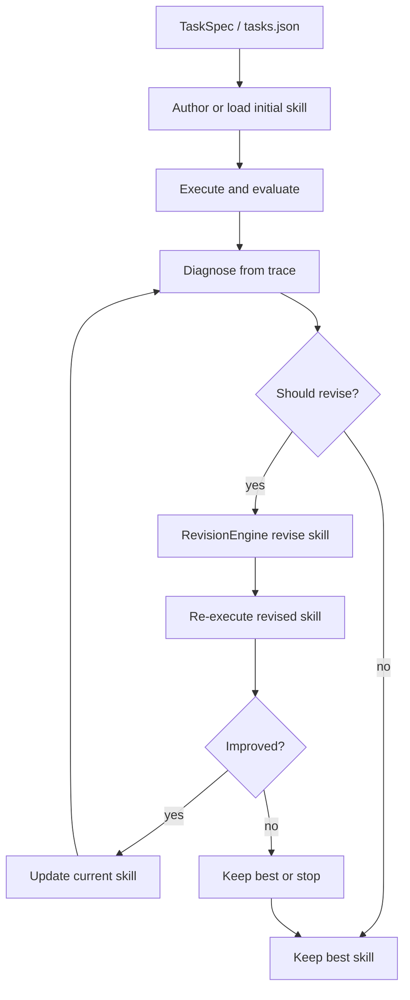

# SkillRevise — paper explanation

Trace-conditioned skill revision (Liu et al.).  
Related: [BEGINNER.md](BEGINNER.md) · [USAGE.md](USAGE.md) · [../OVERVIEW.md](../OVERVIEW.md) · Vendored package: [`src/skillrevise/`](../../src/skillrevise/)

## SkillRevise — trace-conditioned skill revision

> **Important:** SkillRevise is **not** part of SkillReducer (Gao et al.) or TSCG (Sakizli).  
> It is a **separate research paper** by **Liu et al.** This repo **vendors** the upstream package under `src/skillrevise/` and exposes it as `skillreducer revise` — a **separate command** that does **not** run inside `reduce`.

| | SkillReducer | SkillRevise |
|--|--------------|-------------|
| **Paper** | Gao et al., [2603.29919](https://arxiv.org/abs/2603.29919) | Liu et al., [2606.01139](https://arxiv.org/abs/2606.01139) |
| **Title** | Optimizing LLM Agent Skills for Token Efficiency | Improving LLM-Authored Agent Skills via Trace-Conditioned Skill Revision |
| **Goal** | Fewer tokens, same (or better) routing/task behavior | Better skill **behavior** from failed/successful runs |
| **Signal** | Structure of `SKILL.md` + routing oracle | **Execution traces** (diagnose → revise → re-run) |
| **In this repo** | `audit` / `reduce` / `agent` | `skillreducer revise` / `skillrevise` |
| **Code** | `skillreducer/stage{1,2,3}/` | Vendored `src/skillrevise/` · [USAGE.md](USAGE.md) |
| **Upstream** | — | [xuansenpa1/skillrevise](https://github.com/xuansenpa1/skillrevise) |

### Problem

LLM-authored skills often look plausible but **fail at runtime**: missing constraints, wrong tool usage, brittle examples, or incomplete procedures. Token compression alone cannot fix that — you need evidence from **what the agent actually did**.

### Solution

**SkillRevise** improves skills with a **trace-conditioned** loop:

1. **Author / load** an initial skill (or use `--initial-skill`)
2. **Execute** the skill on a task (paired evaluation / harness)
3. **Diagnose** failures and gaps from the execution trace
4. **Revise** the skill conditioned on that diagnosis (and optional principle memory)
5. **Re-execute** and keep revisions that improve outcomes (up to `max_revisions`)

Principle absorption can turn recurring failure patterns into reusable repair principles for later revisions.

### Flow diagram



```text
skillreducer revise path/to/tasks.json --limit 1 --output runs/out.json
        │
        ├─► execute skill on task(s)
        ├─► diagnose from traces
        ├─► revise SKILL.md (trace-conditioned)
        └─► re-evaluate; keep improving revisions
```

### How this repository implements SkillRevise

| Paper idea | How this repo does it |
|------------|------------------------|
| Vendored upstream package | `src/skillrevise/` (MIT; see `VENDOR.md`) |
| Harness loop | `src/skillrevise/core/loop.py` (`HarnessLoop`) |
| Diagnosis | `src/skillrevise/method/diagnosis.py` |
| Revision | `src/skillrevise/method/revision.py` |
| Principle memory | `src/skillrevise/method/principles.py` |
| CLI forward | `skillreducer revise` → `skillrevise.cli` (no separate `skillreducer/revise` package) |
| Benchmark evals only | `skillrevise-benchmark` · [benchmarks/README.md](src/skillrevise/benchmarks/README.md) |
| Direct entry points | `skillrevise` / `skillrevise-llm` after `pip install -e .` |

**Install:**

```bash
pip install -e .
# optional analysis plots:
# pip install -e ".[revise-analysis]"
```

**Run:**

```bash
skillreducer revise --skillrevise-help
skillrevise path/to/tasks.json --limit 1 --baseline-only --output runs/out.json
skillrevise-benchmark path/to/tasks.json --manifest-kind skillsbench --limit 1
```

**What is not vendored:** large upstream benchmark `data/` bundles — clone [xuansenpa1/skillrevise](https://github.com/xuansenpa1/skillrevise) if you need full eval sets.

**Separation from reduce:**

| Does | Does not |
|------|----------|
| Ship SkillRevise in-tree | Change Stages 1–3 or TSCG |
| Expose `skillreducer revise` | Run automatically during `reduce` |
| Improve skill quality from traces | Guarantee token reduction |

---

---

## References

- Paper: https://arxiv.org/abs/2606.01139
- Upstream: https://github.com/xuansenpa1/skillrevise
- BibTeX: [CITATION.md](../../CITATION.md)
