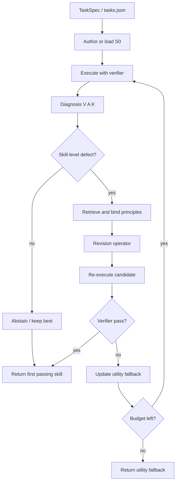

# SkillRevise Paper — Detailed Explanation

**Paper:** SkillRevise: Improving LLM-Authored Agent Skills via Trace-Conditioned Skill Revision  
**Authors:** Yuxuan Liu, Zhaochen Su, Lingyun Xie, Yuhao Zhang, Qing Zong, Jiahe Guo, Zhongwei Xie, Yiyan Ji, Yauwai Yim, Hongyu Luo, Xiyu Ren, Ruan Chenyu, Haoran Li, Yangqiu Song  
**Affiliations:** HKUST, HIT, HIT Shenzhen, Nanjing University, University of Hong Kong  
**arXiv:** [2606.01139](https://arxiv.org/abs/2606.01139)  
**Upstream code:** [HKUST-KnowComp/skillrevise](https://github.com/HKUST-KnowComp/skillrevise) · also [xuansenpa1/skillrevise](https://github.com/xuansenpa1/skillrevise)  
**In this repo:** vendored at [`src/skillrevise/`](../../src/skillrevise/) · CLI: `skillrevise` / `skillreducer revise`

> **Scope.** This file explains the **SkillRevise** paper (Liu et al.) — skill **quality** from execution traces.  
> Token compression of `SKILL.md`: [SkillReducer PAPER](../skillreducer/PAPER.md).  
> Tool schemas: [TSCG PAPER](../tscg/PAPER.md).  
> Hub: [PAPER_DETAIL.md](../PAPER_DETAIL.md) · Overview: [OVERVIEW.md](../OVERVIEW.md).

**All SkillRevise framework design, algorithms, and empirical results are by Liu et al. (2026).**  
This repository vendors the package and exposes it as a separate command — it does **not** run inside `reduce`. See [CITATION.md](../../CITATION.md).

Hands-on: [BEGINNER.md](BEGINNER.md) · [USAGE.md](USAGE.md) · [src/skillrevise/README.md](../../src/skillrevise/README.md)

---

## Table of contents

1. [Executive summary](#1-executive-summary)
2. [Why skill quality is a different problem](#2-why-skill-quality-is-a-different-problem)
3. [Cold-start skill authoring](#3-cold-start-skill-authoring)
4. [What SkillRevise is](#4-what-skillrevise-is)
5. [Diagnosis (task-specific evidence)](#5-diagnosis-task-specific-evidence)
6. [Principle Memory (reusable repair knowledge)](#6-principle-memory-reusable-repair-knowledge)
7. [Revision Operator](#7-revision-operator)
8. [Bounded revision episode](#8-bounded-revision-episode)
9. [Selection: verifier-first + utility fallback](#9-selection-verifier-first--utility-fallback)
10. [Principle absorption](#10-principle-absorption)
11. [Evaluation and reported results](#11-evaluation-and-reported-results)
12. [Related work (paper framing)](#12-related-work-paper-framing)
13. [How this repository implements SkillRevise](#13-how-this-repository-implements-skillrevise)
14. [Full flow overview (paper → CLI)](#14-full-flow-overview-paper--cli)
15. [When to use SkillRevise vs SkillReducer vs TSCG](#15-when-to-use-skillrevise-vs-skillreducer-vs-tscg)
16. [Glossary](#16-glossary)
17. [References](#17-references)

---

## 1. Executive summary

Agent **skills** are procedural artifacts: multi-step workflows, constraints, verification checkpoints, and recovery strategies that extend LLM agents beyond one-off prompts and atomic tools.

**Problem.** One-shot LLM-authored skills often look syntactically fine but are **behaviorally weak**. Expert authoring is expensive and may not match how the executor actually runs. Self-evolution from large trajectory banks helps later, but fails in **cold-start** settings where you only have an imperfect initial skill.

**Solution — SkillRevise.** An **execution-grounded** revision framework:

1. Start from an initial skill \(S_0\) (LLM-authored or provided)
2. **Execute** on a task under a fixed verifier / harness
3. **Diagnose** failures from the trace (what failed, what to keep)
4. **Retrieve + bind** repair principles from a Principle Memory
5. **Revise** the skill with execution-anchored edits
6. **Re-execute**; keep the **first verifier-passing** skill within budget \(B\) (default often \(B=3\))
7. If nothing passes, fall back to the best **utility** candidate

**Headline result (paper):** on SkillsBench, SkillRevise improves the base agent’s success rate from **36.05%** (no skill) / **39.53%** (one-shot skill) to **61.63%** after three revision rounds (GPT-5.5 setting in the paper). Gains transfer across executors and related task environments.

**In this repo:** `skillreducer revise` / `skillrevise` — **separate** from `reduce`. Compressing tokens does not fix wrong procedures; revising from traces does not by itself minimize tokens.

---

## 2. Why skill quality is a different problem

| Artifact | Typical failure mode | Fix |
|----------|----------------------|-----|
| Bloated `SKILL.md` | Too many tokens; diluted attention | **SkillReducer** (structure-aware compression) |
| Verbose tool JSON | Schemas crowd out the task | **TSCG** (schema compiler) |
| Plausible but wrong skill | Missing checks, bad sequencing, brittle shortcuts | **SkillRevise** (trace-conditioned revision) |

Skills are harder than tools: a tool has clear I/O; a skill guides **how** the agent organizes behavior. Value depends on selection, triggering, execution, and maintenance in the target environment — not only on whether the markdown exists.

Recent skill benchmarks (SkillsBench, WildSkills, SWE-Skills-Bench, SkillLearnBench) show that low-quality or poorly matched skills often help little and can even **hurt**. That shifts the research question from “adopt a skill” to “**acquire / revise** a good skill.”

---

## 3. Cold-start skill authoring

The paper groups skill acquisition into:

| Approach | Idea | Cold-start weakness |
|----------|------|---------------------|
| **Retrieval** | Pull skills from a library | May not match task; disrupted execution |
| **Self-evolution** | Refine from many past trajectories | Needs experience; can overfit; weak when starting fresh |
| **Direct authoring** | Expert write or one-shot LLM generate | Experts costly; one-shot often behaviorally unreliable |

**SkillRevise** targets cold-start revision: you already have (or can generate) an imperfect \(S_0\), and you have a **bounded** budget of execute → diagnose → revise → re-execute rounds — without needing a large prior skill corpus.

Design tension (paper Figure 1):

- Too **instance-specific** → brittle shortcuts that don’t transfer  
- Too **generic** → vague advice that doesn’t guide concrete execution  
- Useful skills abstract traces into **actionable, verifier-aligned** principles  

---

## 4. What SkillRevise is

SkillRevise is a **task-specific / general** decomposition:

| Component | Role |
|-----------|------|
| **Diagnosis** | Task-specific: what failed *this* run, what to preserve |
| **Principle Memory** | General: reusable repair patterns for recurring skill defects |
| **Revision Operator** | Turns diagnosis + bound principles into an edited skill + revision trace |
| **Bounded episode** | Finite budget \(B\); verifier-first selection; utility fallback |

It keeps the feedback advantage of self-evolution **without** requiring many prior trajectories.

```text
S0 (initial skill)
   │
   ▼
execute → evidence e_i = (trajectory, verifier, reward, cost)
   │
   ▼
diagnose → D_i = (verification spec, attribution, preservation)
   │
   ▼
retrieve + bind principles → P_i
   │
   ▼
revise → candidate Ŝ_{i+1}
   │
   ▼
re-execute → pass? → return first success
              else → update utility fallback; next round (if budget)
```

---

## 5. Diagnosis (task-specific evidence)

For revision attempt \(i\), Diagnosis is:

\[
D_i = (V_i, A_i, \mathcal{K}_i)
\]

| Piece | Meaning |
|-------|---------|
| \(V_i\) | **Verification specification** — output paths, schemas, formats, assertions, pass/fail checks |
| \(A_i\) | **Failure attribution** — failed checks, observed behavior, probable causes, defect labels |
| \(\mathcal{K}_i\) | **Preservation constraints** — what already worked and must stay intact |

Diagnosis turns raw traces into **repair constraints**: what to fix, what evidence supports the fix, and what must not regress.

**Gating:** if attribution does **not** support a skill-level defect, the episode can **abstain** from editing (avoid pointless rewrites).

---

## 6. Principle Memory (reusable repair knowledge)

Principle Memory \(\mathcal{M}\) stores **repair principles**, not full task solutions. Each principle typically says:

- When to consider it  
- What defect it addresses  
- How the skill should change  
- What executor action the edit should induce  
- How to verify the repair  
- When **not** to transfer it  

The paper initializes with a set of **seed repair principles** (see paper appendix). Retrieval is **hybrid** (sparse + dense) with reciprocal-rank fusion; retrieved candidates are then **bound** to the current diagnosis (evidence requirements + transfer constraints).

Optional **principle absorption** (after evaluation) can turn recurring failure patterns into new reusable principles for later episodes.

---

## 7. Revision Operator

Given current skill \(S_i\), diagnosis \(D_i\), and bound principles \(P_i\):

\[
(\hat{S}_{i+1}, z_i) = \mathcal{R}_\phi(S_i, D_i, P_i)
\]

- \(\hat{S}_{i+1}\): proposed revised skill  
- \(z_i\): **revision trace** — which principles applied, which spans edited, expected acceptance signals, **execution anchors**

An **execution anchor** ties a textual edit to concrete executor behavior (e.g. reload and parse a JSON artifact, check required keys, run local validation). Edits are meant to be **execution-anchored**, not free-form prose polish.

---

## 8. Bounded revision episode

Inputs: task \(T\), initial skill \(S_0\), executor \(\pi_\theta\), Principle Memory \(\mathcal{M}\), budget \(B\) (paper often uses \(B=3\)).

State:

- Current skill \(S_i\) (search base for the next diagnosis)  
- Utility fallback \(S_{\mathrm{fb}}\)  
- Observed candidates \(\mathcal{H}\)

Each round:

1. Execute \(\Phi(T, S_i, \pi_\theta)\) → trajectory, verifier feedback, reward, cost  
2. Build diagnosis; possibly abstain  
3. Retrieve + bind principles  
4. Generate candidate revision  
5. Re-execute candidate  
6. If verifier passes → **return that skill and stop**  
7. Else update fallback if utility improved; continue while budget remains  

Important: the **returned** artifact is the first verifier-passing skill (or fallback), which may differ from the last generated candidate used as the next search base.

---

## 9. Selection: verifier-first + utility fallback

| Priority | Rule |
|----------|------|
| **1. Verifier-first** | Return the first candidate that passes the fixed verifier |
| **2. Utility fallback** | If none pass within \(B\), return the best empirical utility skill |

Utility can combine same-task success/reward, efficiency, transfer to held-out siblings, and interference penalties (CLI exposes `--utility-*` weights / presets in this repo).

This avoids open-ended rewriting and prefers **checkable** success over “sounds better.”

---

## 10. Principle absorption

After (or across) episodes, optional absorption can:

- Abstract recurring defects into new principle entries  
- Grow Principle Memory beyond the seed bank  
- Improve later cold-start revisions on similar failure modes  

In this repo: `--enable-principle-absorption`, `--principle-bank`, `--principle-bank-output`, and related retrieval flags (see [USAGE.md](USAGE.md)).

---

## 11. Evaluation and reported results

Paper evaluation (unified verifier-driven harness):

| Setting | Role |
|---------|------|
| **SkillsBench** | Main professional skill-use benchmark |
| **SkillLearnBench-Random** | Continual / adapted skill learning distribution |
| **SWE-Skills-Bench-Hard** | Software-engineering / harder OOD-style setting |
| **ALFWorld** | Interactive embodied principle-absorption study |

**Reported highlight (SkillsBench, GPT-5.5 in paper):**

| Condition | Success (approx.) |
|-----------|-------------------|
| No skill | 36.05% |
| One-shot skill generation | 39.53% |
| SkillRevise (3 revision rounds) | **61.63%** |

The paper also reports consistent gains across multiple strong executors (e.g. GPT-5.5, Qwen-3.6-Plus, DeepSeek-V4-Pro in their study) and evidence that revised skills **transfer** across executors / related environments — i.e. they capture reusable procedural knowledge, not only executor-specific hacks.

Exact tables, ablations, and budgets: see the [arXiv PDF](https://arxiv.org/abs/2606.01139).

---

## 12. Related work (paper framing)

SkillRevise sits among:

- **Agent skills & benchmarks** — SkillsBench, SkillLearnBench, WildSkills, SWE-Skills-Bench  
- **Self-evolving skills** — SkillX, SkillRL, EvoSkill, SkillClaw, … (usually need more experience)  
- **Memory / reflection / verifier-guided repair** — episodic memory, Reflexion-style critique, test-driven code repair  

**Difference:** the unit of improvement is a **reusable skill artifact**, validated under a fixed verifier — not only a single trajectory answer or open-ended library growth.

---

## 13. How this repository implements SkillRevise

| Paper idea | This repo |
|------------|-----------|
| Vendored package | `src/skillrevise/` (MIT; [VENDOR.md](../../src/skillrevise/VENDOR.md)) |
| Harness loop | `core/loop.py` — `HarnessLoop` |
| Paired eval | `core/runner.py` — `PairedRunner` |
| Diagnosis | `method/diagnosis.py` (heuristic / LLM / no-op) |
| Revision | `method/revision.py` |
| Principles | `method/principles.py` |
| Authoring | `method/authoring.py` |
| LLM helpers | `llm/client.py`, `llm/command.py` (`skillrevise-llm`) |
| CLI | `cli.py` → console script `skillrevise` |
| Forward from SkillReducer | `skillreducer revise` → `skillrevise.cli` |
| Benchmarks (eval only) | `benchmarks/` → `skillrevise-benchmark` |

**Not vendored:** large upstream benchmark `data/` bundles — clone upstream if you need full eval sets.

**Does not:** change Stages 1–3, run inside `reduce`, or guarantee token reduction.

---

## 14. Full flow overview (paper → CLI)



**CLI mapping:**

```text
skillrevise tasks.json \
  --initial-skill path/to/SKILL.md \
  --max-revisions 3 \
  --diagnosis-mode … \
  --revision-mode … \
  --output runs/out.json
```

| Paper step | Typical flag / module |
|------------|------------------------|
| Load \(S_0\) | `--initial-skill` |
| Budget \(B\) | `--max-revisions` |
| Diagnosis | `--diagnosis-mode` |
| Revision | `--revision-mode` |
| Principles | `--principle-bank`, `--enable-principle-absorption`, … |
| Baseline only | `--baseline-only` (no revision loop) |
| Output | `--output`, `--summary-output`, `--principle-bank-output` |

Step-by-step commands: [USAGE.md](USAGE.md).

---

## 15. When to use SkillRevise vs SkillReducer vs TSCG

| You care about… | Use | Command |
|-----------------|-----|---------|
| Fewer tokens in `SKILL.md` | SkillReducer | `skillreducer reduce` / `agent` |
| Fewer tokens in tool schemas | TSCG | `skillreducer reduce … --tscg --tools …` |
| Better runtime behavior from failures | **SkillRevise** | `skillrevise` / `skillreducer revise` |

**Recommended order (optional):**

1. **Revise** until the skill passes your tasks / verifier (quality)  
2. **Reduce** (+ optional **TSCG**) to shrink tokens for production context  

Or reduce first for cheaper iteration, then revise — but remember: compression can move content into refs; revision should target the skill the executor actually loads.

---

## 16. Glossary

| Term | Meaning |
|------|---------|
| **Cold-start** | Only an imperfect initial skill; little prior trajectory bank |
| **Diagnosis** | Task-specific failure + preservation summary from a run |
| **Principle Memory** | Store of reusable skill-repair patterns |
| **Execution anchor** | Edit tied to concrete executor checks/actions |
| **Verifier-first** | Prefer first candidate that passes the verifier |
| **Utility fallback** | Best empirical utility skill if none pass |
| **Principle absorption** | Turning recurring failures into new principles |
| **Revision budget \(B\)** | Max diagnose/revise/re-execute rounds |

---

## 17. References

- Paper: https://arxiv.org/abs/2606.01139  
- Upstream: https://github.com/HKUST-KnowComp/skillrevise  
- BibTeX: [CITATION.md](../../CITATION.md)  
- Package README: [src/skillrevise/README.md](../../src/skillrevise/README.md)  
- Benchmarks: [src/skillrevise/benchmarks/README.md](../../src/skillrevise/benchmarks/README.md)

Please cite **Liu et al. (2026)** when discussing SkillRevise methods or numbers — not this GitHub repository alone.
