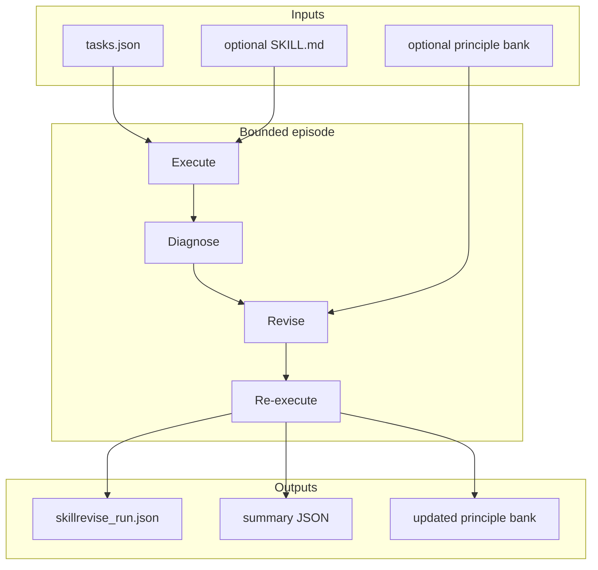

# SkillRevise — usage details + full flow

CLI and package usage for Liu et al. SkillRevise (vendored at `src/skillrevise/`).  
Beginner: [BEGINNER.md](BEGINNER.md) · Paper: [PAPER.md](PAPER.md) · Package: [../../src/skillrevise/README.md](../../src/skillrevise/README.md)  
Papers: [../PAPERS.md](../PAPERS.md) · All-papers overview: [../OVERVIEW.md](../OVERVIEW.md)

---

## Install

```bash
pip install -e .
# optional analysis plots:
# pip install -e ".[revise-analysis]"
```

Console scripts:

| Script | Role |
|--------|------|
| `skillrevise` | Main harness (everyday revision) |
| `skillrevise-llm` | LLM command helper |
| `skillrevise-benchmark` | Paper/eval harnesses only |
| `skillrevise-convert-skillsbench` | Convert SkillsBench dirs → JSON |

Also: `skillreducer revise …` forwards to `skillrevise.cli` (does **not** change `audit` / `reduce` / `agent`).

---

## Full flow overview

### What you provide

| Input | Required? | Notes |
|-------|-----------|-------|
| `tasks.json` (TaskSpecs) | Yes | Tasks to execute / revise against |
| Initial `SKILL.md` | Optional | `--initial-skill`; else authoring modes can create one |
| Principle bank JSON | Optional | `--principle-bank` for structured LLM revision |
| LLM command | For LLM modes | `--llm-command` (stdin prompt → stdout response) |
| Verifier / harness | For real benches | `--harness-command`, `--verifier-command`, … |

### End-to-end loop

```text
1. Load tasks.json (+ optional --initial-skill)
2. Optional: baseline-only run (no skill / no revision) for comparison
3. For each selected task (up to --limit / --max-revisions):
      execute → diagnose → (optional) revise → re-execute
4. Keep first verifier-passing skill, else utility fallback
5. Write run JSON (--output) + optional summary / principle-bank outputs
```



### Recommended workflows

**A. Smoke test (no LLM revision)**

```bash
skillrevise path/to/tasks.json --limit 1 --baseline-only --output runs/baseline.json
```

**B. Revise an existing skill (heuristic or LLM modes)**

```bash
skillrevise path/to/tasks.json \
  --initial-skill path/to/SKILL.md \
  --max-revisions 3 \
  --output runs/revise.json \
  --summary-output runs/summary.json
```

**C. Via SkillReducer forwarder**

```bash
skillreducer revise --skillrevise-help
skillreducer revise path/to/tasks.json --limit 1 --baseline-only --output runs/out.json
```

**D. After quality is good → compress tokens (separate tools)**

```bash
skillreducer reduce path/to/revised-skill --output optimized/
# optional schemas:
skillreducer reduce path/to/revised-skill --tscg --tools tools.json
```

---

## Everyday revision (CLI)

```bash
skillrevise --help
skillrevise path/to/tasks.json --limit 1 --baseline-only --output runs/out.json
skillrevise path/to/tasks.json --initial-skill path/to/SKILL.md --max-revisions 2

skillrevise-llm --help
```

### Important flags

| Flag | Purpose |
|------|---------|
| `--output` | Run artifact JSON (default `skillrevise_run.json`) |
| `--summary-output` | Compact summary JSON |
| `--task-id` / `--family` / `--limit` | Filter which tasks run |
| `--max-revisions` | Revision budget \(B\) (paper often uses 3) |
| `--baseline-only` | Evaluate without revision loop |
| `--baseline-run` | Reuse no-skill traces from a prior baseline JSON |
| `--initial-skill` | Seed `SKILL.md` |
| `--author-mode` | How to create an initial skill when missing |
| `--diagnosis-mode` | Heuristic / LLM / … |
| `--revision-mode` | Heuristic / LLM / free-form / … |
| `--principle-bank` | JSON repair-principle bank |
| `--enable-principle-absorption` | Grow principles from failures |
| `--disable-principle-memory` | Turn off principle retrieval |
| `--principle-bank-output` | Write updated bank |
| `--llm-command` | External LLM for `llm` modes |
| `--utility-preset` / `--utility-*` | Utility fallback weights |
| `--manifest-kind` | Benchmark manifest flavor when applicable |
| `--harness-command` / `--verifier-command` | Real benchmark execution |
| `--continue-after-non-improving-revision` | Keep searching after non-improving edits |

Use `skillrevise --help` for the full list (large; many ablation / retrieval knobs).

---

## Benchmarks (eval only)

The `benchmarks/` package is for paper/eval harnesses (SkillsBench, SkillLearnBench, ALFWorld).  
You do **not** need it to revise your own skills.

```bash
skillrevise-benchmark --help
skillrevise-benchmark path/to/tasks.json --manifest-kind skillsbench --limit 1 --output runs/out.json
skillrevise-convert-skillsbench --help
```

Details: [benchmarks/README.md](../../src/skillrevise/benchmarks/README.md)

**Not vendored:** large upstream benchmark `data/` bundles — clone [xuansenpa1/skillrevise](https://github.com/xuansenpa1/skillrevise) or [HKUST-KnowComp/skillrevise](https://github.com/HKUST-KnowComp/skillrevise) if needed.

---

## Configuration notes

- **LLM mode:** env vars / flags from `skillrevise --help` / `skillrevise-llm --help` (author / diagnosis / revision modes). `--llm-command` is required when any mode is `llm`.
- **Heuristic mode:** many paths work without a remote LLM (`--baseline-only`, heuristic diagnosis/revision).
- **Outputs:** JSON via `--output`; optional `--summary-output` and `--principle-bank-output`.
- **Strict LLM:** `--strict-llm` fails instead of silently falling back when LLM calls fail (see `--help`).

---

## Python API

```python
import skillrevise
from skillrevise.cli import main as skillrevise_main
from skillrevise.core.loop import HarnessLoop
```

| Module | Role |
|--------|------|
| `core.loop.HarnessLoop` | Orchestrates author → evaluate → diagnose → revise |
| `method.diagnosis` | Heuristic / LLM / no-op diagnosers |
| `method.revision` | Heuristic / LLM / free-form revision engines |
| `method.principles` | Principle bank + absorption |
| `method.authoring` | Template / LLM / prior-guided skill authors |

---

## Separation from reduce / TSCG

| Does | Does not |
|------|----------|
| Live under `src/skillrevise/` | Live under Stages 1–3 |
| Expose `skillrevise` + `skillreducer revise` | Run automatically during `reduce` |
| Improve skill quality from traces | Guarantee token reduction |

Attribution: [LICENSE](../../src/skillrevise/LICENSE) · [VENDOR.md](../../src/skillrevise/VENDOR.md) · [CITATION.md](../../CITATION.md)
