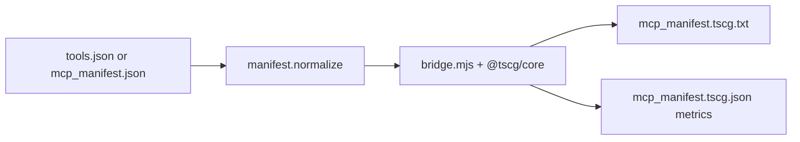

# TSCG Paper — Detailed Explanation

**Primary paper:** TSCG: Deterministic Tool-Schema Compilation for Agentic LLM Deployments  
**Author:** Furkan Sakizli  
**arXiv:** [2605.04107](https://arxiv.org/abs/2605.04107)  
**Code / package:** [SKZL-AI/tscg](https://github.com/SKZL-AI/tscg) · [`@tscg/core`](https://www.npmjs.com/package/@tscg/core)

**Companion paper:** Tool-Schema Compression Enables Agentic RAG Under Constrained Context Budgets  
**arXiv:** [2605.26165](https://arxiv.org/abs/2605.26165)

> **Scope.** This file explains **TSCG** (Sakizli) — MCP / tool **JSON schema** tokens.  
> Skill markdown: [SkillReducer PAPER](../skillreducer/PAPER.md).  
> Skill quality: [SkillRevise PAPER](../skillrevise/PAPER.md).  
> Hub: [PAPER_DETAIL.md](../PAPER_DETAIL.md) · Overview: [OVERVIEW.md](../OVERVIEW.md).

**All TSCG algorithms, operators, and empirical results are by Furkan Sakizli (2026).**  
This repository only *calls* `@tscg/core` after SkillReducer; it is not the TSCG research project.

See [CITATION.md](../../CITATION.md). Hands-on: [BEGINNER.md](BEGINNER.md) · [USAGE.md](USAGE.md).

---

## Table of contents

1. [Executive summary](#1-executive-summary)
2. [Two token budgets](#2-two-token-budgets)
3. [The problem: tool-schema / “MCP tax”](#3-the-problem-tool-schema--mcp-tax)
4. [What TSCG is](#4-what-tscg-is)
5. [How compression works (operators)](#5-how-compression-works-operators)
6. [Profiles and model archetypes](#6-profiles-and-model-archetypes)
7. [Key results](#7-key-results)
8. [Companion paper: Agentic RAG](#8-companion-paper-agentic-rag)
9. [Privacy / offline behavior](#9-privacy--offline-behavior)
10. [How this repository uses TSCG](#10-how-this-repository-uses-tscg)
11. [Full flow overview](#11-full-flow-overview)
12. [Glossary](#12-glossary)
13. [Attribution](#13-attribution)

---

## 1. Executive summary

Agent frameworks (OpenAI function calling, Anthropic tool use, **MCP**) send **tool schemas as JSON**. JSON is great for machines, but verbose for LLMs — especially when dozens of tools are injected every turn.

**TSCG** is a **deterministic compiler** at the API boundary:

- Input: tool definitions (OpenAI or Anthropic / MCP-style JSON)
- Output: compact structured text (fewer tokens)
- **No** model API calls, **No** fine-tuning, **No** runtime search
- Formal claim: **≥ 51%** savings on well-formed schemas (paper)
- Practical range often **~50–72%** depending on catalog and profile

**Why this repo cares:** skills and tools burn **different** token budgets. SkillReducer shrinks `SKILL.md`; TSCG shrinks tool schemas. Together they cut more context cost than either alone.

---

## 2. Two token budgets

```text
YOU PROVIDE
  1) Skill folder (SKILL.md)     → SkillReducer paper (Gao et al.)
  2) MCP tools JSON (optional)   → TSCG paper (Sakizli)   ← this doc

skillreducer reduce ./my-skill --tscg --tools tools.json
        │
        ├─► A) SkillReducer → lean SKILL.md (+ refs + scripts/)
        └─► B) TSCG         → mcp_manifest.tscg.txt (compact schemas)
```

SkillReducer **never invents** your MCP tools. You must supply the JSON (`--tools` or `mcp_manifest.json` in the skill folder). Without it, `--tscg` is skipped and skill reduction still runs.

---

## 3. The problem: tool-schema / “MCP tax”

| Issue | Effect |
|-------|--------|
| Full JSON Schema per tool | Thousands of tokens per turn |
| Many MCP servers at once | Context filled with schemas, not the user task |
| Small models (4B–14B) | JSON format mismatch → tool-use failures |
| Agentic RAG | Schemas compete with retrieved documents for the same window |

The companion RAG paper shows a **binary** failure mode at tight budgets (e.g. 8K): verbose JSON can overflow so RAG accuracy collapses; compressed schemas restore usability.

---

## 4. What TSCG is

| Property | Detail |
|----------|--------|
| Type | Deterministic schema **compiler** |
| Language | TypeScript (`@tscg/core`, zero runtime deps) |
| Speed | Sub-millisecond for typical catalogs |
| Profiles | `conservative` / `balanced` / `aggressive` |
| Model option | Tokenizer **profile** name (e.g. `claude-sonnet`) — **not** a remote LLM call |

TSCG does **not** rewrite your `server.py`. It transforms the **schema text** that would be shown to the model (or saved for later use).

---

## 5. How compression works (operators)

The paper describes composable operators (names vary slightly across docs; idea is the same):

- Shorten type encodings  
- Drop redundant keys / boilerplate words  
- Restructure for attention / parsing  
- Align to tokenizer profiles  
- Optionally reinforce critical params (e.g. SAD — Selective Anchor Duplication, Claude-oriented / aggressive)

**Intuition (before → after):**

```text
BEFORE (JSON — many tokens)
{
  "type": "function",
  "function": {
    "name": "get_weather",
    "description": "Get the current weather for a location",
    "parameters": {
      "type": "object",
      "properties": {
        "location": { "type": "string", "description": "City name" }
      },
      "required": ["location"]
    }
  }
}

AFTER (TSCG — fewer tokens)
get_weather(location:str!) -> weather data
```

| Symbol (typical) | Meaning |
|------------------|---------|
| `str!` | required string |
| `pages?:str` | optional string |
| `-> …` | short return / result hint |

---

## 6. Profiles and model archetypes

| Profile | Use when |
|---------|----------|
| `conservative` | Max compatibility; milder savings |
| `balanced` | Default in this repo — good savings/accuracy tradeoff |
| `aggressive` | Max compression (stronger operators; model-sensitive) |

The paper also reports **model archetypes** (e.g. Opus “operator-hungry”, Sonnet “operator-robust”, GPT-5.2 “operator-sensitive”) — pick profile per deployment model when accuracy matters.

Config in this repo: `tscg.profile` / env `tscg_profile` (see [USAGE.md](USAGE.md)).

---

## 7. Key results

From the primary TSCG paper / benchmarks (approximate; see arXiv for tables):

| Finding | Result |
|---------|--------|
| Token savings | Often ~50–72% on schemas; formal ≥51% bound on well-formed schemas |
| Small models | Can recover from near-zero tool accuracy to high accuracy at larger catalogs |
| BFCL / TAB | Accuracy often retained or improved vs verbose JSON (ARR can be >1) |
| Real MCP schemas | Synthetic gains transfer closely to production-like MCP schemas |
| Speed | Compile catalogs in milliseconds locally |

Exact numbers depend on model, tool count, and profile — always check your own `mcp_manifest.tscg.json` metrics after `--tscg`.

---

## 8. Companion paper: Agentic RAG

**Title:** Tool-Schema Compression Enables Agentic RAG Under Constrained Context Budgets  
**arXiv:** [2605.26165](https://arxiv.org/abs/2605.26165)

**Claim:** Tool schemas and retrieved context fight for the same window. With TSCG (conservative, ~44–50% schema savings):

- At **8K** with many tools, JSON can **overflow** → ~0% useful RAG  
- Compressed schemas **enable** RAG again (+~20 pp EM average in their 8K study; larger lifts on some setups)  
- At **32K** where both fit, accuracy deltas shrink → effect is **budget-driven**, not magic quality boost  
- Scaling: JSON may overflow hundreds of tools sooner than compressed forms  

**Takeaway:** if your agent loads many MCP tools, schema compression is not optional polish — it can be what keeps the task in context.

---

## 9. Privacy / offline behavior

| Step | Network? |
|------|----------|
| `npm install` `@tscg/core` | Yes — download package once from npm |
| `compress()` / our `bridge.mjs` | **No** — local stdin/stdout only |
| SkillReducer `--no-llm` | No LLM calls for skill stages |
| SkillReducer with API key | Yes — only for Stage 1/2 LLM features |

TSCG does **not** upload your MCP JSON to Sakizli’s servers or to a model API.

---

## 10. How this repository uses TSCG

| Piece | Path |
|-------|------|
| Normalize OpenAI / MCP shapes | `skillreducer/tscg/manifest.py` |
| Node bridge | `skillreducer/tscg/bridge.mjs` → `@tscg/core` |
| Python entrypoint | `skillreducer/tscg/compress.py` (`compress_tools`) |
| Package folder README | `skillreducer/tscg/README.md` |
| CLI | `--tscg` / `--tools` on `reduce` and `agent` |
| Config | `tscg.enabled`, `tscg.profile`, `tscg.model` |

```text
You provide:  skill folder + tools.json (or mcp_manifest.json)
                    │
                    ▼
skillreducer reduce --tscg --tools tools.json
                    │
        ┌───────────┴───────────┐
        ▼                       ▼
  SkillReducer              Node bridge
  (Gao et al.)              + @tscg/core (Sakizli)
  lean SKILL.md             mcp_manifest.tscg.txt
```

---

## 11. Full flow overview



**CLI path:**

```bash
cd skillreducer/tscg && npm install && cd ../..
skillreducer reduce ./my-skill --tscg --tools tools.json
```

**Outputs** (under `optimized/<skill-name>/`):

| File | Meaning |
|------|---------|
| `mcp_manifest.json` | Your tools (full schemas, saved for review) |
| `mcp_manifest.tscg.txt` | Compressed schemas — use these to save tokens |
| `mcp_manifest.tscg.json` | Before/after token metrics |

Worked before/after: [../REDUCTION_FLOW.md](../REDUCTION_FLOW.md) · Commands: [USAGE.md](USAGE.md).

---

## 12. Glossary

| Term | Meaning |
|------|---------|
| **Tool schema** | Name, description, parameters JSON for one tool |
| **MCP tax / tools tax** | Tokens spent injecting schemas every turn |
| **TSCG** | Deterministic tool-schema compiler (paper / `@tscg/core`) |
| **Profile** | conservative / balanced / aggressive operator set |
| **ARR** | Accuracy-Retained Ratio (TSCG accuracy ÷ baseline) |
| **SAD** | Selective Anchor Duplication (aggressive / Claude-oriented) |

---

## 13. Attribution

Please cite Sakizli (2026) when discussing TSCG methods or numbers.  
Please cite Gao et al. (2026) for SkillReducer skill debloating.  
Please cite Liu et al. (2026) for SkillRevise.  
This GitHub repo is an integration, not a substitute for those papers.
