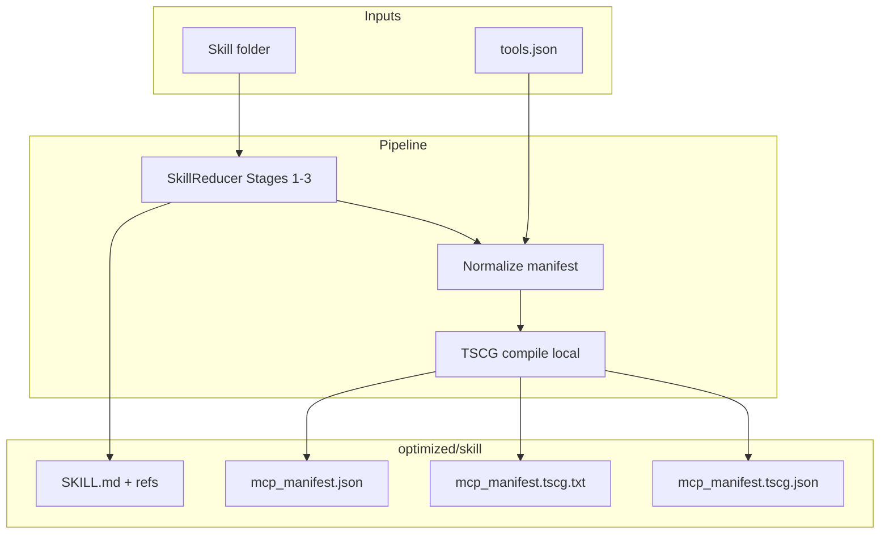

# TSCG — usage details + full flow

Compress MCP / tool JSON schemas with Sakizli’s `@tscg/core` after (or with) SkillReducer.  
Beginner: [BEGINNER.md](BEGINNER.md) · Paper: [PAPER.md](PAPER.md)  
Hub: [../PAPER_DETAIL.md](../PAPER_DETAIL.md) · Overview: [../OVERVIEW.md](../OVERVIEW.md)

---

## Prerequisites

| Need | Notes |
|------|--------|
| SkillReducer installed | `pip install -e .` from repo root |
| Node.js 18+ | Runs `@tscg/core` |
| Your tools JSON | `--tools tools.json` **or** `mcp_manifest.json` in the skill folder |

```bash
cd skillreducer/tscg
npm install
cd ../..
```

---

## Full flow overview

```text
1. Put tools in tools.json (or mcp_manifest.json inside the skill)
2. npm install once in skillreducer/tscg
3. skillreducer reduce ./my-skill --tscg --tools tools.json
4. Read optimized/my-skill/mcp_manifest.tscg.txt (+ metrics JSON)
5. Feed compressed schemas to your agent / MCP client instead of raw JSON
```



Without tools JSON, `--tscg` is skipped (`TSCG skipped: no tools`). Skill reduction still runs.

---

## Commands

```bash
# Skill reduction + TSCG
skillreducer reduce ./my-skill --tscg --tools tools.json

# Manifest already inside the skill folder
skillreducer reduce ./my-skill --tscg

# Via agent command
skillreducer agent ./my-skill --tscg --tools tools.json

# Heuristic skill stages + TSCG (no LLM for SkillReducer)
skillreducer reduce ./my-skill --no-llm --tscg --tools tools.json
```

### Accepted tools JSON shapes

Common shapes (see `skillreducer/tscg/README.md` for details):

- OpenAI function-calling list / `{ "tools": [ … ] }`
- Anthropic / MCP-style tool definitions
- A skill-local `mcp_manifest.json`

The bridge normalizes, then compiles. TSCG does **not** scrape `server.py` for you.

---

## Config (env / YAML)

| Setting | Env | YAML |
|---------|-----|------|
| Enable TSCG | `tscg_enabled` | `tscg.enabled` |
| Profile | `tscg_profile` | `tscg.profile` (`conservative` / `balanced` / `aggressive`) |
| Tokenizer profile name | `tscg_model` | `tscg.model` (e.g. `claude-sonnet` — **not** a remote LLM call) |

Default profile in this repo: **balanced**.

```yaml
tscg:
  enabled: false
  model: claude-sonnet
  profile: balanced
```

---

## Outputs

Inside `optimized/<skill-name>/`:

| File | Meaning |
|------|---------|
| `mcp_manifest.json` | Your tools (full schemas, saved for review) |
| `mcp_manifest.tscg.txt` | Compressed schemas — use these to save tokens |
| `mcp_manifest.tscg.json` | Before/after token metrics |

Report excerpt:

```text
TSCG (tool schemas)
  Tools: N | before -> after tokens (X% savings)
```

Before/after worked example: [../REDUCTION_FLOW.md](../REDUCTION_FLOW.md).

---

## Implementation map

| Piece | Path |
|-------|------|
| Normalize OpenAI / MCP shapes | `skillreducer/tscg/manifest.py` |
| Node bridge | `skillreducer/tscg/bridge.mjs` → `@tscg/core` |
| Python entrypoint | `skillreducer/tscg/compress.py` (`compress_tools`) |
| Package folder README | `skillreducer/tscg/README.md` |

---

## Troubleshooting

| Message | Fix |
|---------|-----|
| `TSCG skipped: no tools` | Pass `--tools` or add `mcp_manifest.json` |
| `Node.js not found` | Install Node 18+ |
| `TSCG dependency missing` | `npm install` in `skillreducer/tscg` |

**Privacy:** compiling schemas is local stdin/stdout after `npm install`. It does not upload your MCP JSON to a remote LLM.

---

## Separation from SkillReducer / SkillRevise

| Does | Does not |
|------|----------|
| Shrink tool / MCP JSON tokens | Edit `SKILL.md` body rules |
| Run as optional `--tscg` on `reduce`/`agent` | Replace Stages 1–3 |
| Run offline (after npm install) | Fix skill behavior quality (use SkillRevise) |
